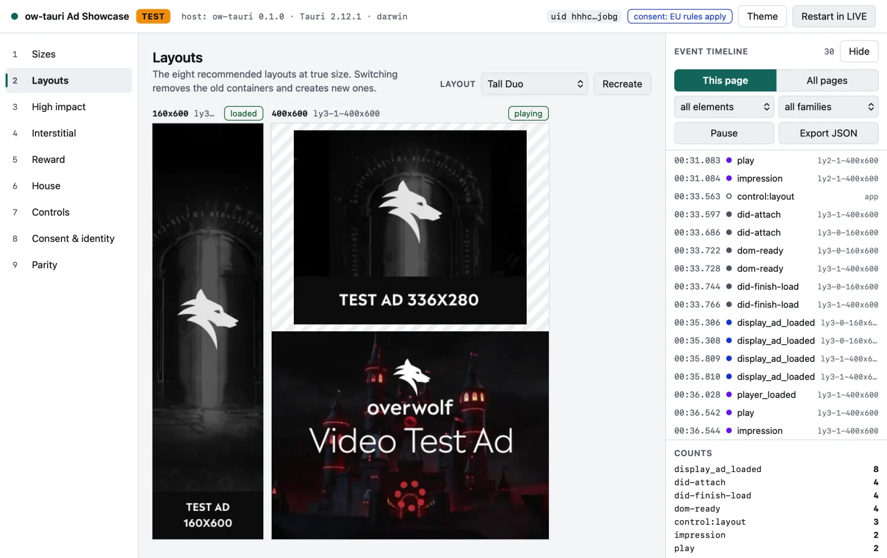
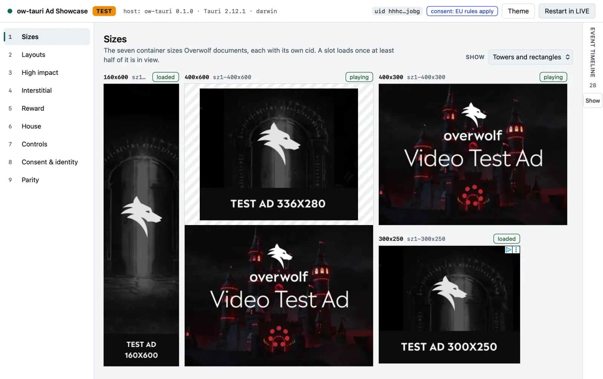
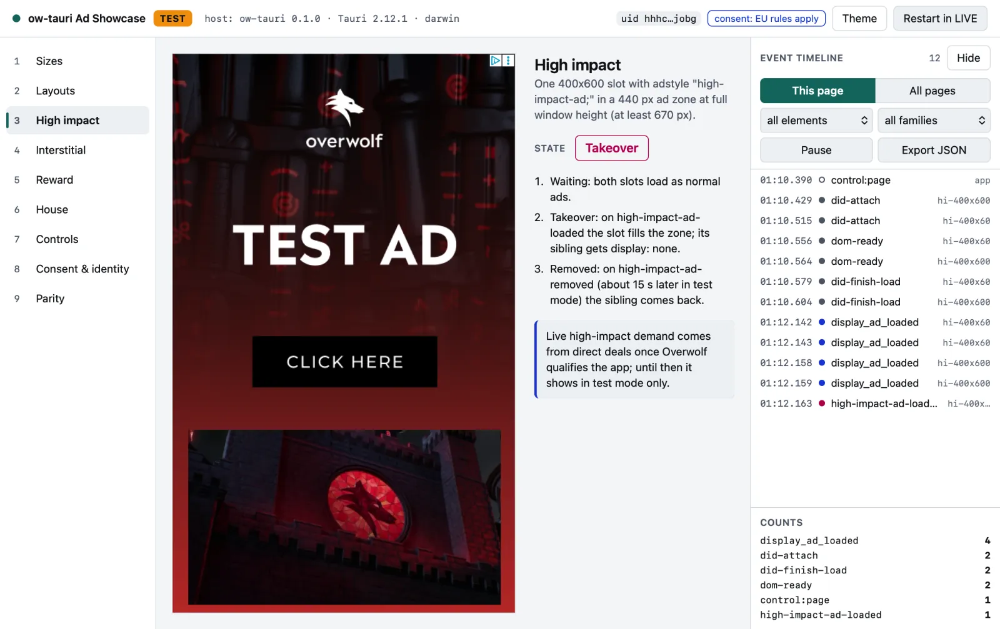
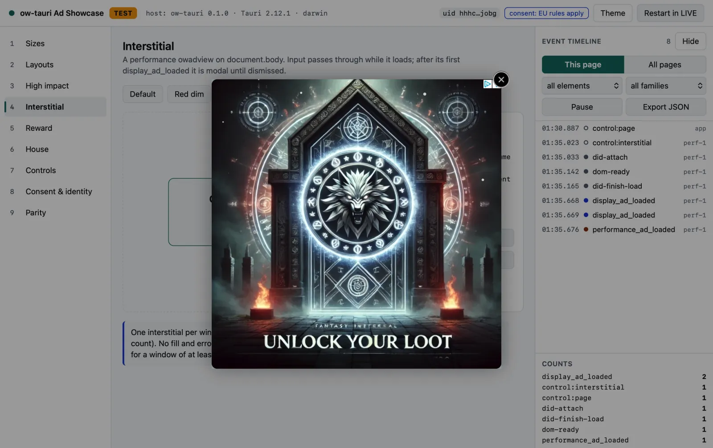
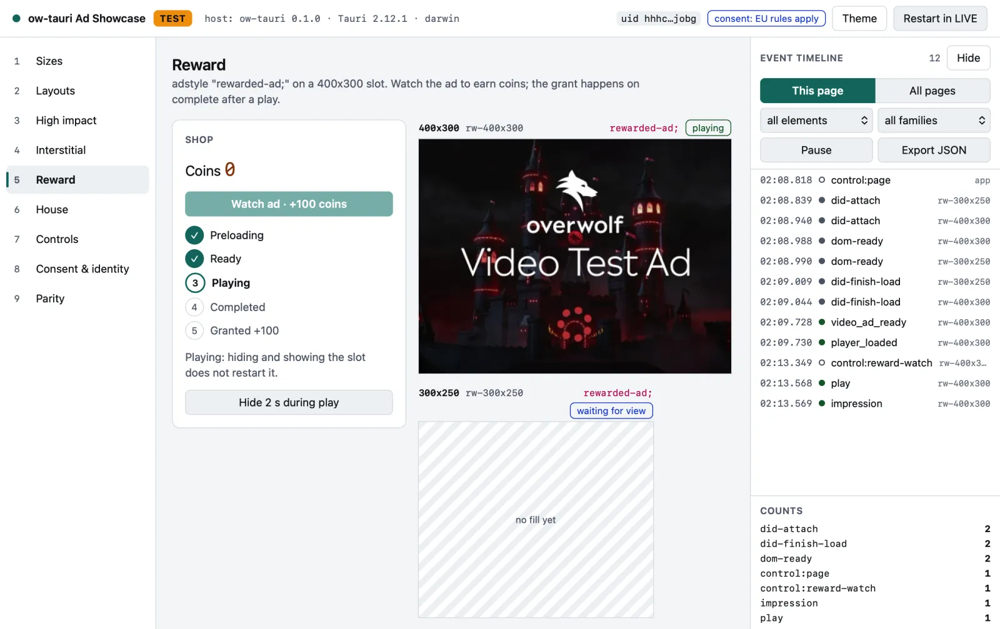
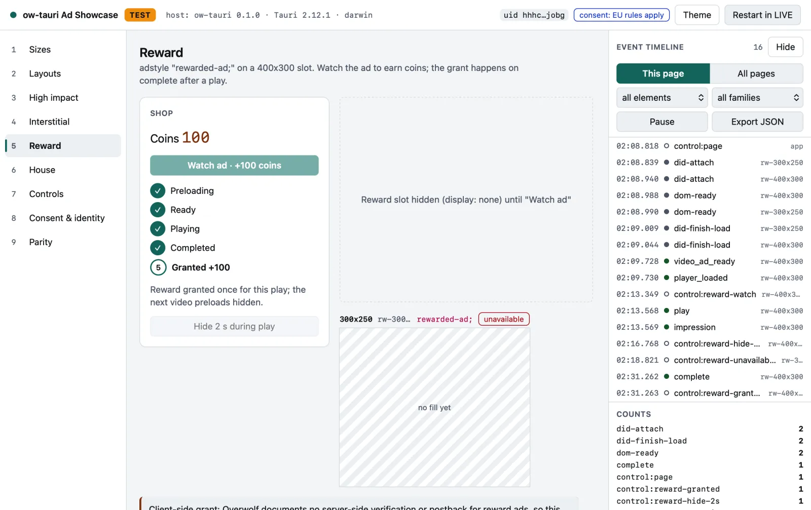
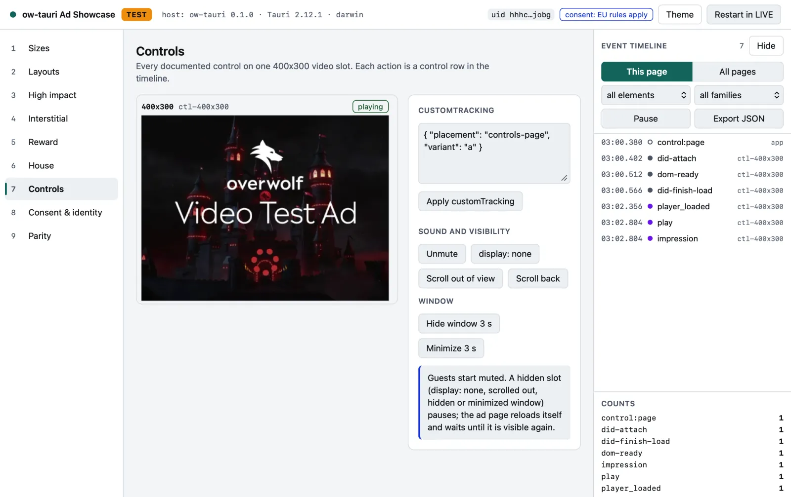

# ow-tauri

Overwolf ads, consent and app analytics for Tauri 2 apps. ow-tauri is for
developers who build an Overwolf app on Tauri or move an ow-electron app to
Tauri, and for the Overwolf team reviewing how it works.

`tauri-plugin-overwolf` gives a Tauri app what ow-electron gives an Electron
app: the `<owadview>` ad element, Overwolf's consent flow, email hashes, the
anonymous app analytics, the app uid and machine ids, and Overwolf's update
feed on Windows. Overwolf receives the same data it receives from an
ow-electron app, with two differences in normal use:

- The analytics host label says `tauri` where ow-electron says `electron`.
  This one is intended.
- On macOS, ad subresource requests do not carry ow-electron's `Origin` and
  `x-ow-*` headers ([CONTRACT D.8.3](docs/CONTRACT.md#d83-per-platform),
  [OQ-05](docs/OPEN-QUESTIONS.md#oq-05-request-shaping-for-the-ad-page)).

Edge cases and platform gaps are listed in
[PARITY](docs/PARITY.md#deviations).

> Pre-release, on GitHub only. The packages are not on crates.io or npm yet,
> so you install them from this repository ([Quick start](#quick-start)).
> The first release is planned as 1.0.0-rc.1. Overwolf has not yet confirmed
> live ads in production or console uploads for apps built on Tauri; see
> [docs/OVERWOLF-ONBOARDING.md](docs/OVERWOLF-ONBOARDING.md). This project is
> not affiliated with or endorsed by Overwolf.

<picture>
  <source media="(prefers-color-scheme: dark)" srcset="docs/images/showcase/layouts-dark.webp">
  
</picture>

<sub>The <a href="examples/ad-showcase">ad-showcase</a> example running on Tauri with Overwolf test ads. Every <code>&lt;owadview&gt;</code> event shows up in the timeline on the right.</sub>

## Where to start

| If you want to | Go to |
|---|---|
| see it running on your machine | [Try it](#try-it) below |
| present the demo to someone | [Showing it to someone](examples/ad-showcase/README.md#showing-it-to-someone) in the ad-showcase README |
| evaluate it for Overwolf | [For the Overwolf team](#for-the-overwolf-team) below |
| add ads to a Tauri app | [Quick start](#quick-start) below, then [docs/GETTING-STARTED.md](docs/GETTING-STARTED.md) |
| move an ow-electron app | [docs/MIGRATION.md](docs/MIGRATION.md) |
| ship your app to users | [docs/PRODUCTION-CHECKLIST.md](docs/PRODUCTION-CHECKLIST.md), then [docs/OVERWOLF-ONBOARDING.md](docs/OVERWOLF-ONBOARDING.md) |
| fix a problem | [docs/TROUBLESHOOTING.md](docs/TROUBLESHOOTING.md) |
| look up the API | [docs/api/README.md](docs/api/README.md) |
| find any doc | [docs/README.md](docs/README.md) |
| work on the plugin | [CONTRIBUTING.md](CONTRIBUTING.md) |

## Try it

This runs the [ad-showcase](examples/ad-showcase) example on Tauri with
Overwolf test ads only. Ads show on Windows and macOS; on Linux the app runs
but ads report `unsupported`.

You need Node.js 22.12 or newer, Rust 1.90 or newer and the rest of the
[Tauri 2 prerequisites](https://tauri.app/start/prerequisites/) for your OS
(WebView2 on Windows). Then run:

```sh
git clone https://github.com/AlloryDante/ow-tauri
cd ow-tauri
npm install
npm run build --workspace tauri-plugin-overwolf-api
cd examples/ad-showcase
npm run start:tauri:test
```

`start:tauri:test` builds a debug app with the page embedded and runs it
with `--test-ad`. The first Rust build takes most of the time. The example's
tracked identity is a placeholder, so a clean clone runs in test mode with
the placeholder's uid.

The [example's README](examples/ad-showcase/README.md) covers live mode,
hot reload, the ow-electron twin for side-by-side runs, using your own app
identity and how to present the demo.

## See it working

The [ad-showcase](examples/ad-showcase) example puts every ad format on its own page. It runs the same
renderer on ow-electron and on Tauri, so you can compare the two side by side. The pictures below are
Overwolf test ads (the TEST badge in the top bar); the app id is a placeholder and shown masked.

<table>
<tr>
<td width="50%" valign="top">

<picture>
  <source media="(prefers-color-scheme: dark)" srcset="docs/images/showcase/sizes-dark.webp">
  
</picture>

<b>Sizes.</b> All seven Overwolf ad sizes, each its own <code>&lt;owadview&gt;</code>. A slot loads once half of it is in view.

</td>
<td width="50%" valign="top">

<picture>
  <source media="(prefers-color-scheme: dark)" srcset="docs/images/showcase/high-impact-dark.webp">
  
</picture>

<b>High impact.</b> A <code>high-impact-ad;</code> slot takes over its zone; the zone's other ads hide and come back when it is removed.

</td>
</tr>
<tr>
<td width="50%" valign="top">

<picture>
  <source media="(prefers-color-scheme: dark)" srcset="docs/images/showcase/interstitial-dark.webp">
  
</picture>

<b>Interstitial.</b> A <code>performance</code> ad covers the window. Input passes through while it loads; after it loads it stays until the user closes it.

</td>
<td width="50%" valign="top">

<picture>
  <source media="(prefers-color-scheme: dark)" srcset="docs/images/showcase/reward-playing-dark.webp">
  
</picture>

<b>Reward: playing.</b> A <code>rewarded-ad;</code> video slot stays hidden until the player presses Watch, then plays.

</td>
</tr>
<tr>
<td width="50%" valign="top">

<picture>
  <source media="(prefers-color-scheme: dark)" srcset="docs/images/showcase/reward-granted-dark.webp">
  
</picture>

<b>Reward: granted.</b> Coins are granted once, on <code>complete</code> after a <code>play</code>. The grant happens in the app; Overwolf documents no server-side check.

</td>
<td width="50%" valign="top">

<picture>
  <source media="(prefers-color-scheme: dark)" srcset="docs/images/showcase/controls-dark.webp">
  
</picture>

<b>Controls.</b> Mute, hide, scroll out of view, hide or minimize the window. Every action is a row in the timeline.

</td>
</tr>
</table>

How to run it, in test and live mode: [examples/ad-showcase](examples/ad-showcase).

## For the Overwolf team

Look at these first:

1. The [ad-showcase](examples/ad-showcase) in test mode ([Try it](#try-it)).
   The same page runs on ow-electron and on Tauri.
2. [docs/CONTRACT.md](docs/CONTRACT.md): every request, header, cookie,
   file, id and event Overwolf receives from an app on the plugin.
3. [docs/PARITY.md](docs/PARITY.md): how the plugin's data is compared with
   ow-electron's, and where each behaviour stands.
4. [docs/ARCHITECTURE.md](docs/ARCHITECTURE.md): how the plugin hosts
   Overwolf's ad and consent pages inside a Tauri app.
5. [docs/SECURITY.md](docs/SECURITY.md): the threat model, and how trust
   differs from ow-electron.

To rerun the proof yourself, follow
[tools/parity-harness/README.md](tools/parity-harness/README.md#rerun-the-proof).
The harness uses only the public `@overwolf/ow-electron` and
`@overwolf/ow-cli` packages on their `latest` dist-tag. Every known
difference from ow-electron is in
[PARITY: Deviations](docs/PARITY.md#deviations), with the platform gaps
listed below it.

These questions need an answer from Overwolf:

- [OQ-20](docs/OPEN-QUESTIONS.md#oq-20-live-ads-from-a-tauri-host): how an app on ow-tauri gets live ads enabled in production.
- [OQ-18](docs/OPEN-QUESTIONS.md#oq-18-updates-and-the-console): whether the console accepts and serves a Tauri NSIS `setup.exe`.
- [OQ-05](docs/OPEN-QUESTIONS.md#oq-05-request-shaping-for-the-ad-page): whether the macOS request-header gap is acceptable for fill and attribution.
- [OQ-03](docs/OPEN-QUESTIONS.md#oq-03-host-labelling-owver-owversion-extra-fields): whether dashboards or the ad and consent pages depend on the `electron` host label.
- [OQ-09](docs/OPEN-QUESTIONS.md#oq-09-signing-and-integrity-for-tauri-builds): what Overwolf signing should cover in a Tauri build.
- [OQ-43](docs/OPEN-QUESTIONS.md#oq-43-installer-signing-expectations): whether Overwolf re-signs installers served from the console, and with which certificate.
- [OQ-41](docs/OPEN-QUESTIONS.md#oq-41-the-install-record-of-a-per-machine-install): where a per-machine install should write its install record.
- [OQ-42](docs/OPEN-QUESTIONS.md#oq-42-a-uid-override-and-attribution): whether Overwolf checks that traffic for a uid comes from that uid's app.
- [OQ-A1](docs/OPEN-QUESTIONS.md#oq-a1-reward-ads): the supported way to request a reward ad, and the grant signal.
- [OQ-A10](docs/OPEN-QUESTIONS.md#oq-a10-live-demand-for-demand-gated-formats): whether a demo app can get live high impact, interstitial and reward demand.

The [index of open questions](docs/OPEN-QUESTIONS.md#index) has every
question with its status.

Release status: nothing is published to crates.io or npm, and there are no
tags or GitHub releases. [docs/RELEASING.md](docs/RELEASING.md) describes
how a release will be made.

## Packages

| Package | Registry (planned) | What it is |
|---|---|---|
| `tauri-plugin-overwolf` | crates.io | the Tauri plugin (Rust) |
| `tauri-plugin-overwolf-api` | npm | the JavaScript API and the `<owadview>` runtime |
| `tauri-plugin-overwolf-cli` | npm | the `ow-tauri` command: `init`, `migrate`, `doctor`, `sign`, `sign-exe` |
| `tauri-plugin-overwolf-unstable` | crates.io | a helper the plugin uses to turn on Tauri's `unstable` feature; you never add it yourself |

[Quick start](#quick-start) shows how to install them from this repository.

## Platforms

| Platform | Status |
|---|---|
| Windows 10 22H2 and 11, x64 | supported; ads need WebView2 98.0.1108.44 or newer |
| macOS 14 or newer, Apple Silicon | supported |
| Windows arm64, Intel Macs, macOS before 14 | best effort |
| Linux | builds and runs; ads report `unsupported` |
| Android, iOS | builds; every command answers `unsupported` |

You need Rust 1.90 or newer and the `tauri` crate 2.12.1 or newer, below 3.
See [docs/COMPATIBILITY.md](docs/COMPATIBILITY.md).

## Quick start

The packages are not on crates.io or npm yet, so you install from GitHub.
In a Tauri 2 app, add the crate to `src-tauri/Cargo.toml`:

```toml
[dependencies]
tauri-plugin-overwolf = { git = "https://github.com/AlloryDante/ow-tauri" }

[build-dependencies]
tauri-plugin-overwolf = { git = "https://github.com/AlloryDante/ow-tauri", default-features = false, features = ["build"] }
```

Pack the npm packages in a clone next to your app and install the two
tarballs. `npm pack` prints their file names; the version follows the
repository:

```sh
git clone https://github.com/AlloryDante/ow-tauri ../ow-tauri
cd ../ow-tauri
npm ci
npm pack -w tauri-plugin-overwolf-api -w tauri-plugin-overwolf-cli
cd -
npm add ../ow-tauri/tauri-plugin-overwolf-api-0.1.0.tgz
npm add -D ../ow-tauri/tauri-plugin-overwolf-cli-0.1.0.tgz
npm exec --no -- ow-tauri init --author "Example Studio" --name "Example App"
```

Take the crate and the npm packages from the same commit.
[GETTING-STARTED](docs/GETTING-STARTED.md#before-you-start) shows how to pin
it with `rev`.

`init` adds the `plugins.overwolf` block (with test ads on), the
`overwolf:default` permission for your first window's webview, the Windows
installer hooks and a `.gitignore` line.

`src-tauri/build.rs`:

```rust
fn main() {
    tauri_plugin_overwolf::build::run().expect("tauri-plugin-overwolf build step failed");
    tauri_build::build();
}
```

`src-tauri/src/lib.rs`:

```rust
#[cfg_attr(mobile, tauri::mobile_entry_point)]
pub fn run() {
    let builder = tauri::Builder::default().plugin(tauri_plugin_overwolf::init());

    #[cfg(target_os = "macos")]
    let builder = builder.on_web_content_process_terminate(
        tauri_plugin_overwolf::web_content_process_terminate_hook(),
    );

    builder
        .run(tauri::generate_context!())
        .expect("error while running tauri application");
}
```

In `src/main.ts`:

```ts
import 'tauri-plugin-overwolf-api/adview';
```

In `index.html`:

```html
<div style="width: 400px; height: 300px">
  <owadview cid="main-mrec" slotsize="400x300"></owadview>
</div>
```

Then run `npm run tauri dev`. The full walkthrough, with the React version,
is [docs/GETTING-STARTED.md](docs/GETTING-STARTED.md).

Two rules apply from the start:

- Grant permissions to webviews, not windows. An ad is a child webview
  inside your window, so a capability that names the window also covers the
  ad. Use `"webviews": ["main"]`
  ([docs/api/permissions.md](docs/api/permissions.md)).
- Run the CLI with `npm exec --no -- ow-tauri`, not `npx ow-tauri`, so it
  always runs the copy in your project.

## Coming from ow-electron

Your `<owadview>` HTML stays. `ow-tauri migrate` reads your ow-electron
`package.json` and prints the `plugins.overwolf` block that keeps your app's
uid; with `--write` it merges the block into your `tauri.conf.json`. With the
same uid, Overwolf and your users see the same app, with the same consent
answer and first-launch state. Your
main-process code moves to Rust and Tauri plugins. See
[docs/MIGRATION.md](docs/MIGRATION.md).

Overwolf packages (game events, overlay, recorder) are not available on
Tauri.

## Documentation

[docs/README.md](docs/README.md) lists every page by task. The ones you
will open most:

| Page | For |
|---|---|
| [GETTING-STARTED](docs/GETTING-STARTED.md) | adding the plugin to an app, step by step |
| [CONFIG](docs/CONFIG.md) | every `plugins.overwolf` key |
| [api/](docs/api/README.md) | the JavaScript API, `<owadview>`, the Rust API, permissions and test helpers |
| [AD-FORMATS](docs/AD-FORMATS.md) | display, video, high-impact, interstitial and reward ads |
| [TROUBLESHOOTING](docs/TROUBLESHOOTING.md) | no fill, macOS input, errors and their fixes |
| [PRODUCTION-CHECKLIST](docs/PRODUCTION-CHECKLIST.md) | before you release your app |

## Examples

| Example | Shows |
|---|---|
| [quickstart-vanilla](examples/quickstart-vanilla) | the GETTING-STARTED app |
| [quickstart-react](examples/quickstart-react) | the same in React 19 |
| [ad-showcase](examples/ad-showcase) | every ad format and size |
| [packages-sample](examples/packages-sample) | Overwolf's ow-electron sample, moved to Tauri |

## Repository layout

| Path | Contents |
|---|---|
| `crates/tauri-plugin-overwolf` | the plugin |
| `crates/tauri-plugin-overwolf-unstable` | the `unstable` helper crate |
| `packages/api`, `packages/cli` | the npm packages |
| `packages/guest-shims` | scripts the plugin injects into its own ad and consent webviews |
| `examples/` | the example apps |
| `tools/parity-harness` | the lab that compares the plugin's traffic with ow-electron's |
| `docs/` | the documentation |

## Contributing and security

See [CONTRIBUTING.md](CONTRIBUTING.md) and [SECURITY.md](SECURITY.md).

## License

The crates and npm packages are licensed under MIT or Apache-2.0, at your
option ([LICENSE-MIT](LICENSE-MIT), [LICENSE-APACHE](LICENSE-APACHE)).
`examples/packages-sample` keeps the MIT notice of its upstream
(Copyright Overwolf Ltd.).

Overwolf and ow-electron are trademarks of Overwolf Ltd.
