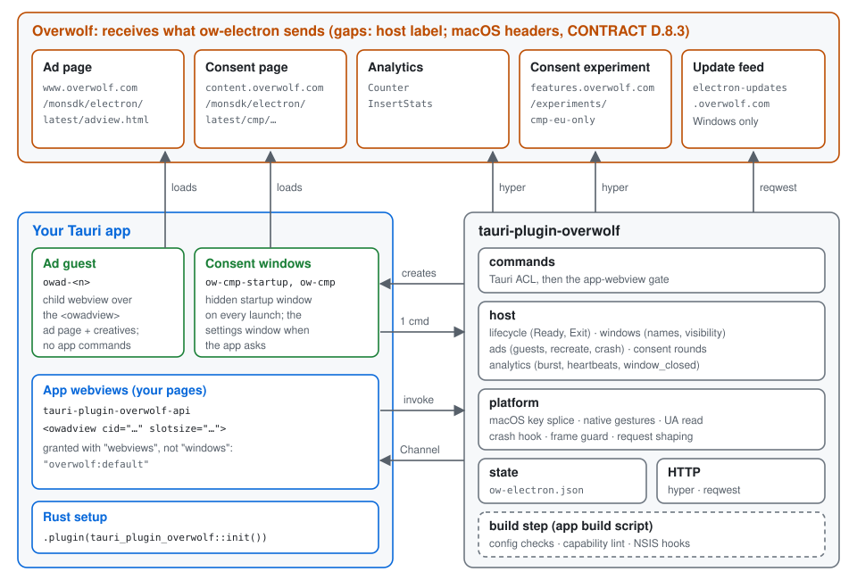
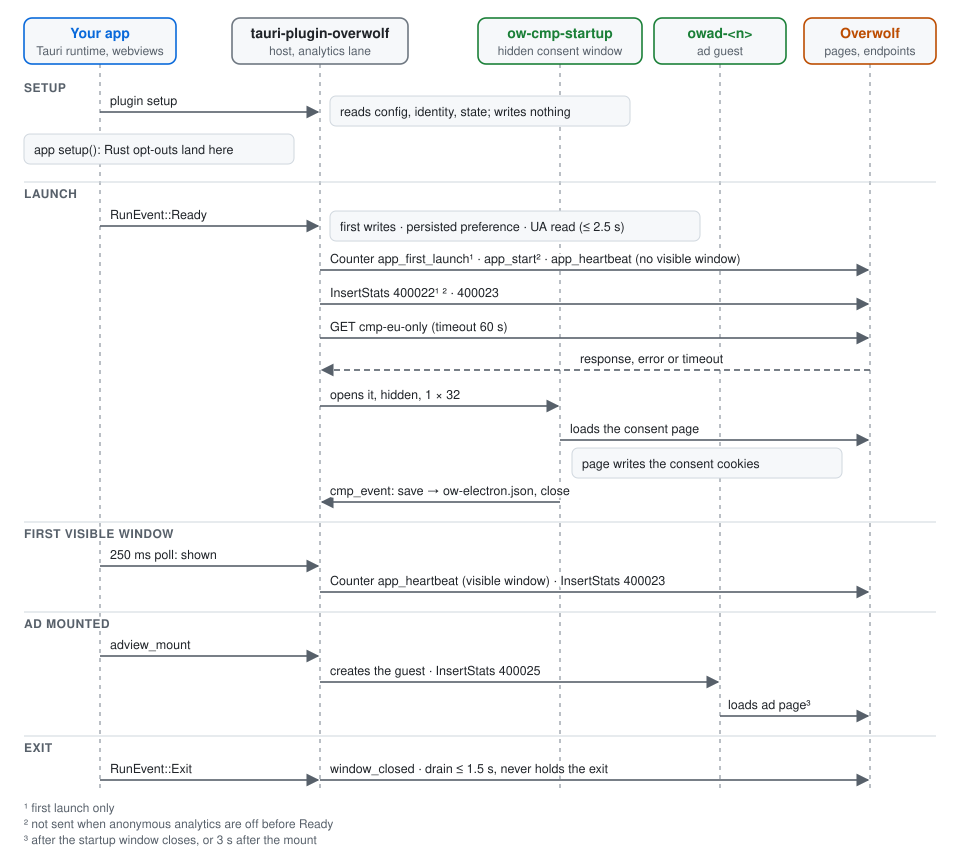

# Architecture

This page is for contributors. It explains how `tauri-plugin-overwolf` hosts
Overwolf's ad and consent pages inside an ordinary Tauri app, and how it
sends Overwolf what ow-electron sends. The one deliberate difference is the
host label (`tauri`). Where a platform cannot reproduce a behaviour, the
contract names the gap: on macOS, ad subresource requests have no forced
`Origin` and no `x-ow-*` headers ([CONTRACT D.8.3](CONTRACT.md#d83-per-platform)).

- The wire contract (what Overwolf receives) is in
  [CONTRACT.md](CONTRACT.md).
- The threat model is in [SECURITY.md](SECURITY.md).
- The reasons behind each design choice are in the
  [decision records](adr/README.md), starting with
  [ADR 0017](adr/0017-tauri-native-pivot.md).

## 1. What runs where



An app built on ow-tauri is a plain Tauri app. The plugin adds three kinds
of native webviews and one background service:

| Part | Who owns it | What it does |
|---|---|---|
| App webviews | the app | the app's own pages. They call the plugin's commands through `tauri-plugin-overwolf-api` and declare ads with `<owadview>`. |
| Ad guests (`owad-<n>`) | the plugin | one child webview per mounted `<owadview>`, placed over the element, loading Overwolf's ad page. |
| Consent windows (`ow-cmp*`) | the plugin | Overwolf's consent page: hidden at every launch, and visible when the app opens the privacy settings. |
| The host (`src/host/`) | the plugin | lifecycle, window tracking, ads, consent and analytics, driven by Tauri's own events. |

Ad guests and consent windows load Overwolf's pages straight from Overwolf.
The plugin never proxies or rewrites them. It shapes their requests the way
ow-electron does (§6.6) and injects a small shim that gives the page the
same `window.__overwolf__` and consent globals it has under ow-electron
(CONTRACT D).

## 2. Packages and modules

### 2.1 Packages

| Package | Kind | Contents |
|---|---|---|
| `tauri-plugin-overwolf` | crate | the plugin, the config schema, the build step (`build` feature) and the Windows updater (`updater` feature) |
| `tauri-plugin-overwolf-unstable` | crate | a shim that turns on Tauri's `unstable` feature for Windows and macOS targets only (§7) |
| `tauri-plugin-overwolf-api` | npm | browser-only ESM: command wrappers (`.`), the `<owadview>` element (`./adview`), the updater (`./updater`), test helpers (`./testing`) |
| `tauri-plugin-overwolf-cli` | npm | the `ow-tauri` CLI: `sign`, `sign-exe`, `migrate`, `init`, `doctor` |
| `packages/guest-shims` | private | sources of the scripts injected into guests; the build output is committed in `crates/tauri-plugin-overwolf/js/` |

See [ADR 0021](adr/0021-package-split.md).

### 2.2 Crate modules

Paths are under `crates/tauri-plugin-overwolf/src/`.

| Module | Job |
|---|---|
| `plugin.rs` | `init()` and `Builder`. Every Tauri hook is forwarded to `host::dispatch` and nowhere else. |
| `commands/` | the 25 Tauri commands, the caller gate (`require_app_webview`) and the guest commands `adview_event` and `cmp_event` |
| `host/dispatch.rs` | fans each hook out to the modules that own it (§2.3) |
| `host/lifecycle.rs` | `on_ready`, `on_exit` and the restart sentinel (§4) |
| `host/windows.rs` | app window tracking, names, titles and the visibility ticker (§3) |
| `host/ads.rs`, `host/ads/driver.rs` | the ad guests: mount, geometry, visibility, close-hide, recreate, crash recovery, click-outs (§6) |
| `host/consent.rs`, `consent/` | consent rounds, consent windows, the cookie fallback (§4.5) |
| `host/analytics.rs`, `analytics/` | the analytics session, request encoding, the hyper transport and the user-agent discovery (§4.4) |
| `ads/` | pure guest rules: labels, limits, the frame guard, the recreate limiter, the guest config |
| `platform/` | native code: the WebView2 and WKWebView hooks, the macOS key splice (`input.rs`), native gestures (`gesture.rs`), the UA read (`ua.rs`), the terminate hook (`terminate.rs`), machine ids (`machine.rs`) |
| `state/` | `ow-electron.json` and `ow-tauri.json` (§8) |
| `identity.rs`, `app_identity.rs` | uid, cuid, muid, phase and email hashes |
| `capabilities.rs` | the two runtime capabilities for guests and consent windows |
| `config.rs` | the `plugins.overwolf` schema, defaults and validation |
| `updater/` | the Windows update client (§9) |
| `build/` | the build step: merged config, capability lint, NSIS hooks, signing resource (§10) |

### 2.3 Hook fan-out

`plugin.rs` registers Tauri's plugin hooks and forwards each one to
`host::dispatch`:

| Hook | Goes to |
|---|---|
| `on_window_ready` | windows |
| `on_webview_ready` | windows, `platform::input` (macOS), ads |
| `on_page_load` | windows (app webviews), ads (all), consent (`ow-cmp*`) |
| `on_navigation` | ads (`owad-*`), consent (`ow-cmp*`); app webviews navigate as the app allows |
| `on_event` | `Ready` → `lifecycle::on_ready`; `Exit` → `lifecycle::on_exit`; window events → windows, ads, consent |

`RunEvent::ExitRequested` is deliberately ignored: the plugin never
prevents an exit and never exits the app.

## 3. Windows and webviews

### 3.1 Window classes

| Label | Kind | Created by | Tracked for analytics | May embed ads | Commands |
|---|---|---|---|---|---|
| any other label | window or webview | the app | yes, unless it matches `analytics.excludeWindows` | yes, if its capability grants `overwolf:default` and its page is on an app origin | what its capability grants |
| `owad-<n>` | child webview | the plugin, on `adview_mount` | no | no | `adview_event` only |
| `ow-cmp-startup`, `ow-cmp-startup-<n>` | hidden window | the plugin, every launch | no | no | `cmp_event` only |
| `ow-cmp-default` | hidden window | the plugin, on the first settings call | no | no | `cmp_event` only |
| `ow-cmp` | window | the plugin, on `openAdPrivacySettingsWindow` / `openCMPWindow` | no | no | `cmp_event` only |

Labels that start with `owad-` or `ow-cmp` are reserved. If the app creates
one, the plugin logs an error once and never tracks it or accepts it as an
embedder (`config.rs` `is_reserved_label`).

Guest labels count up from `owad-1` across the process and skip any label
already in use (`ads/rules.rs` `next_guest_label`).

### 3.2 Window tracking and names

`host/windows.rs` tracks every app window by its Tauri label, from
`on_window_ready` until `WindowEvent::Destroyed`
([ADR 0019](adr/0019-window-tracking-and-naming.md)). Each tracked window
has:

- **a name**, which feeds `window_closed.name`, the guest's `windowName` and
  `x-ow-window`:
  - The naming webview is the webview whose label equals the window label,
    or else the first non-reserved webview in the window.
  - Its last finished page URL goes through ow-electron's derivation
    (`analytics::window_analytics_name`).
  - For an app-origin URL whose path is empty or ends in `/`, the path is
    read as `<path>index.html`, so `tauri://localhost/` gives `index`.
  - The name is fixed the first time the window is seen visible with a
    loaded page.
  - `set_window_name` overrides it. That call has no ow-electron
    counterpart.
- **a title**, which feeds `window_closed.title`: the title declared in
  `tauri.conf.json`, else the native title. Tauri's placeholder `Tauri App`
  becomes the product name.
- **a visible period**, which starts when a poll sees the window shown and
  not minimized. It ends when a poll sees it hidden or minimized, when the
  window is destroyed, or at exit. A counted period of at least one second
  sends `window_closed`.

### 3.3 Visibility ticker

Tauri emits no shown, hidden or minimized events, and `show()` on an
unfocused window emits nothing at all. So one ticker polls `is_visible`
and `is_minimized` of every tracked window every 250 ms (`TICK`), in **one**
main-thread hop per tick. The polls drive:

- the first heartbeat with `hasVisibleWindow: true`;
- `window_closed`;
- the hourly heartbeat check (a heartbeat every 12 hours);
- the guests' `window-hidden` and `window-minimized` messages.

The ticker parks only when no window is tracked (a tray-only app). It
wakes for a window registration, a pending deadline or the hourly check.
`WindowEvent::Resized` and `Focused` trigger an immediate poll of their
window.

## 4. Lifecycle

See [ADR 0018](adr/0018-lifecycle-ready-exit.md).



### 4.1 Setup

At `Builder::build` → `setup` (`plugin.rs`) the plugin:

- parses and validates `plugins.overwolf` merged with the `Builder`
  options;
- resolves the identity (uid, cuid, machine ids read, phase);
- registers the two runtime capabilities (§5.2);
- starts the analytics transport lane;
- adds the restart sentinel;
- on macOS, warns once if the terminate hook is not wired (§6.5).

**Setup writes nothing to disk or the registry.** A second instance that
`tauri-plugin-single-instance` ends during setup leaves no trace.

The app's own `setup` closure runs after the plugin's setup and before
`RunEvent::Ready`. Calls made there, such as
`app.overwolf().disable_anonymous_analytics()`, land before the burst, as
ow-electron's pre-ready main-process calls do.

### 4.2 Ready: the launch burst

`lifecycle::on_ready` runs once, at `RunEvent::Ready`:

1. **First writes.** It writes machine ids that are missing from the
   registry (Windows), repairs a corrupt `ow-tauri.json`, and stores a new
   per-install muid when that strategy is on.
2. **Persisted preference.** An earlier
   `setAnonymousAnalyticsPreference(false)` turns anonymous analytics off
   before the burst.
3. **Started.** Mounts that were waiting may proceed.
4. **UA discovery** starts (§4.4). Host requests wait for it for at most
   2.5 s (`UA_WAIT`).
5. **Burst.** It queues, in this order:
   - Counter `<label>_app_first_launch` (first launch only);
   - Counter `<label>_app_start`;
   - Counter `<label>_app_heartbeat` with `hasVisibleWindow: false`;
   - InsertStats 400022 (first launch only);
   - InsertStats 400023.

   It then writes `firstLaunch: true`.
6. **Consent round** (§4.5). Its `cmp-eu-only` request is queued after the
   burst.
7. **Ticker** (§3.3) starts.

The transport lane starts requests in call order. CONTRACT E.2 lists every
event and its trigger.

### 4.3 Exit and restart

- **`RunEvent::ExitRequested`**: nothing. The plugin never calls
  `prevent_exit` and never calls `exit`.
- **`RunEvent::Exit`**: `lifecycle::on_exit` ends every visible period
  (queuing `window_closed`). It then waits for the transport lane to drain
  for at most 1.5 s (`DRAIN_LIMIT`). The drain runs on the lane's own
  thread, so `on_exit` never needs the main thread.
- **Restart.** `AppHandle::restart()`, including `tauri-plugin-process`'s
  `relaunch()`, skips both exit events. Tauri's `cleanup_before_exit` still
  clears the app's resource table, which drops the plugin's `ExitSentinel`.
  Its `Drop` runs the same `on_exit`, which is idempotent.
- **Windows logoff or shutdown** delivers no exit event. The drain is lost,
  as it is after a crash.

### 4.4 User-agent discovery

Overwolf requests carry ow-electron's user agent: the platform webview's
default user agent plus ow-electron's tokens (CONTRACT E.1).
`host/analytics.rs` `start_user_agent_discovery` reads it from the first app
webview at Ready, without blocking the main thread (`platform/ua.rs`):

- **Windows**: `ICoreWebView2Settings2::UserAgent`.
- **macOS**: a guarded key-value read of the webview's `userAgent`, else
  its non-empty `customUserAgent`.

A value is accepted only if it has the platform default's shape. An app
that sets its own user agent therefore never leaks it to Overwolf. In that
case, or when there is no app webview at Ready (a tray app), or when the
read fails, the plugin builds the default from a per-OS template. On
Windows the template uses the WebView2 major version.

The result is used for host requests, ad guests and consent windows. App
webviews keep their own user agent.

### 4.5 Consent round

`host/consent.rs` repeats ow-electron's consent flow
([ADR 0015](adr/0015-startup-consent-window.md), CONTRACT D.6):

1. `GET cmp-eu-only`, queued after the burst, with a client timeout of
   `consent.euOnlyTimeoutMs` (60 s). A timeout counts as a failed request.
2. Whatever the outcome, the plugin opens the startup window
   `ow-cmp-startup`. It is hidden, 1 × 32, skips the taskbar and cannot be
   focused, and it runs in the ads environment with the composed user
   agent.
3. The consent page saves consent through the shim's `window.cmp` and
   `window.privacy`, which call `cmp_event`. The plugin stores `cmp` in
   `ow-electron.json` and sends `consent` to the running guests. The page
   writes its cookies on `.overwolf.com` itself and closes its window.
4. If the consent cookies are still missing after the window closes, the
   plugin writes them with the same attributes
   (`consent.hostCookieFallback: "auto"`).
5. `isCMPRequired()` resolves when the startup page has loaded.
6. Each guest's first navigation waits until the startup window has closed,
   or until 3 s after its mount.
7. If the last app window closes during the round, the startup window
   closes once its page has saved, or at `consent.readyTimeoutMs`.

`openAdPrivacySettingsWindow` and `openCMPWindow` open the settings window
`ow-cmp`. The first call also opens the hidden `ow-cmp-default`, as
ow-electron does. A JavaScript `cmpURL` must have an origin in
`consent.allowedCmpOrigins`.

## 5. Security model

The full threat model is in [SECURITY.md](SECURITY.md). This section
explains the mechanisms.

### 5.1 Trust boundaries

- **App webviews** are trusted as far as their capability grants, and no
  further. Commands that ran in ow-electron's main process now answer
  page scripts, so personal data and machine ids sit in opt-in permission
  sets.
- **Ad guests** run Overwolf's ad page and third-party creatives. They are
  untrusted.
- **Consent windows** run Overwolf's consent page. They are untrusted
  beyond their one command.
- **Rust code** in the app is trusted.

### 5.2 Capabilities

Tauri matches a capability that names a window for every webview in that
window, and ad guests live in the app's windows. So:

- Apps grant `overwolf:default` with `"webviews"`. The build step warns on
  any capability that selects `"windows"` while the `ads` feature is on.
- It fails the build on a `remote.urls` entry that covers Overwolf pages,
  such as `https://*`.
- At setup, the plugin adds two capabilities of its own
  (`capabilities.rs`), both remote-only and both selecting webviews:
  - `ow-tauri-adview-guest`: `owad-*` on
    `https://www.overwolf.com/monsdk/electron/*`, granting
    `overwolf:adview-guest`;
  - `ow-tauri-cmp`: `ow-cmp*` on
    `https://content.overwolf.com/monsdk/electron/*`, granting
    `overwolf:cmp-window`.

The permission sets are listed in
[SECURITY.md](SECURITY.md#permission-sets).

### 5.3 Remote content rules

- **Frame guard.** A guest or consent window may load only `http`, `https`,
  `about`, `data` and `blob` URLs, and never on a `localhost` or
  `*.localhost` host (`ads/rules.rs` `frame_url_allowed`). A frame on the
  app's origin inside a guest would otherwise pass Tauri's ACL as a local
  page.
  - **Windows**: navigations are cancelled in `NavigationStarting`, and per
    frame through `FrameCreated` and the frame's own `NavigationStarting`
    (`platform/webview.rs` `guard_frames`, which needs WebView2 98.0.1108.44
    or newer).
  - **macOS**: the rule is applied in the navigation hook, which wry calls
    for every frame.
- **Asset protocol.** On Windows the guard cannot stop a subresource
  request to `http://asset.localhost/` (wry answers it first), and the ads
  environment has web security off. Apps keep the asset protocol off or
  narrowly scoped
  ([SECURITY.md](SECURITY.md#the-asset-protocol-caveat-windows)).
- **Top-level navigation.** A guest that leaves Overwolf's ad page is sent
  back. Windows cancels before the load. macOS bounces at
  `PageLoadEvent::Started`, because wry's hook cannot tell the top frame
  from the others. The target opens in the system browser only after native
  activation (§5.6).
- **Consent windows** may navigate to Overwolf pages, `data:` and
  `about:blank`. The settings window may also navigate to a custom
  `cmpURL`'s origin.
- **Guest command.** `adview_event` checks the caller's label and page.
  Names are 1 to 64 characters, data is at most 16 KiB, and token buckets
  limit each guest (`ads.guestLimits`).

### 5.4 Caller gate

After the ACL, every app command calls `commands::require_app_webview`. It
refuses with `forbidden` when the caller's label is reserved, or when its
page is not on `tauri://localhost`, `http(s)://tauri.localhost`, the
`devUrl` origin (debug builds only) or an `ads.allowedEmbedderOrigins`
entry.

`adview_update`, `adview_unmount` and `adview_command` find only elements
mounted by the calling webview.

### 5.5 Content security policy

The plugin injects no script of its own into app webviews, so the app's CSP
applies as written. With `app.withGlobalTauri`, Tauri adds the plugin's
standard global API script (`window.__TAURI__.overwolf`, from
`api-iife.js`), as it does for every plugin; that script does nothing in
`owad-*` and `ow-cmp*` webviews. The recommended baseline:

```text
default-src 'self'; script-src 'self'; style-src 'self' 'unsafe-inline'; img-src 'self' data:; connect-src ipc: http://ipc.localhost; frame-ancestors 'self'
```

`connect-src ipc: http://ipc.localhost` lets the page call commands.
`frame-ancestors 'self'` keeps app pages out of foreign frames. Guests are
separate webviews, not frames, so the CSP needs no Overwolf origin.

### 5.6 Gesture authority

See [ADR 0020](adr/0020-native-gesture-authority.md). The guest shim still
reports `__host:gesture`, but `ads/mod.rs` treats it as data only. A popup
or an off-Overwolf navigation opens the system browser
(`tauri_plugin_opener::open_url`) only when native activation armed that
guest:

- **macOS** (`platform/gesture.rs`): one `NSEvent` local monitor for left
  mouse-down and key-down.
  - A mouse-down arms guest G when all of these hold: the content view
    hit-tests the event to G's `WKWebView` or a subview, G is shown, G does
    not pass input through, and the window is key.
  - Return, Space or keypad Enter arms G when G is the first responder.
- **Windows** (`platform/webview.rs`): `IsUserInitiated` on new-window
  requests and top-level navigations. A script navigation is also allowed
  when it comes right after native input over the guest.

Arming opens an activation window of `guestLimits.activationWindowMs`
(5000 ms), and the first open consumes it. Opens are capped per guest and
per app (20 per minute each). Each open dispatches `ad-clicked` on the
element.

## 6. Ad guests

The app imports `tauri-plugin-overwolf-api/adview`, which registers the
`<owadview>` element. The runtime finds each element in the document and
calls `adview_mount` with its attributes and rectangle, opening one
Tauri `Channel` for its events. The host's rules for every guest are
summarised at the top of `host/ads.rs`.

### 6.1 Creation

`adview_mount` is async, because `Window::add_child` from a sync command
can deadlock on Windows. It waits for `started` (§4.2) and then calls
`add_child` on the embedder's window with `guest_builder_spec`
(`ads/rules.rs`):

- the next free `owad-<n>` label;
- `about:blank` as the first URL;
- `focused(false)`;
- zoom hotkeys off;
- muted from the start;
- transparent when `ads.transparentGuests` is on (the default);
- the composed user agent;
- the guest shim (`js/adview-host.js`) with its `__overwolf__` config as an
  initialization script.

On Windows, guests and consent windows share their own WebView2
environment: the ads data folder `<appData>/<productName>/EBWebView-ow` and
ow-electron's browser arguments (`ADS_PARITY_ARGS` plus `ads.browserArgs`).
App webviews keep their own environment. Below WebView2 98.0.1108.44, ads
report `unsupported`.

After the guest exists, the plugin forces a window poll, sends InsertStats
400025, dispatches `did-attach`, and lets the first navigation go after the
consent gate (§4.5).

### 6.2 Geometry and zoom

The element sends its rectangle in CSS pixels. The plugin multiplies it by
the page zoom and places the guest at that position in the window:

- **macOS**: zoom = the embedder's native width / `innerWidth`.
- **Windows**: zoom = `devicePixelRatio` / the window scale factor.

Non-finite, negative or oversized rectangles are refused with
`invalid-argument`. Rectangles are not clamped to the window: the native
view clips, as an Electron child view does.

The newest `performance` guest is raised above the window's other child
webviews. It lets input pass through until its first
`performance_ad_loaded`.

### 6.3 Visibility and close-hide

A guest's page sees itself as visible only when its element is visible and
its window is neither hidden, minimized nor closing. `window-hidden` and
`window-minimized` follow the window polls (CONTRACT D.5).

ow-electron hides a guest's document just before its window is destroyed.
ow-tauri does the same, per OS:

- **macOS**: at `WindowEvent::Destroyed`, through native view handles the
  plugin retains until the hide has run.
- **Windows**: at a `CloseRequested` that was not prevented. If the window
  is still alive after a 1 s grace (`CLOSE_GRACE_MS`), the guests get their
  real visibility back.

Close-to-tray (`hide()`) is an ordinary visibility change.

### 6.4 Recreate on reload (macOS)

See [ADR 0024](adr/0024-recreate-on-reload.md). On macOS, with
`ads.recreateOnReload` (default `true`), a reload builds a fresh
`WKWebView`. This covers page-requested reloads, host reloads and crash
recovery. The new view has the same label, place, z-order, mute,
transparency and pass-through state:

- The top frame's `sessionStorage` (origin `https://www.overwolf.com`, at
  most 2,000,000 UTF-16 units, read within 200 ms) is restored by the
  one-shot prelude `js/session-restore.js`. A larger snapshot means an
  in-place reload instead.
- The `RecreateLimiter` allows one recreate per guest every 30 s and 30 per
  hour (`ads.recreateMinIntervalMs`, `ads.recreateMaxPerHour`). Over the
  limit, the guest reloads in place. A reload is never dropped or delayed.
- `Generations` give each native view an id. Events from a closed
  generation are dropped.
- A recreate sends no `did-attach` and no 400025.

Windows reloads in place, as ow-electron does.

### 6.5 Crash handling

- **Windows**: WebView2's `ProcessFailed` reports a guest crash.
- **macOS**: Tauri exposes the web content process's end only through the
  app-wide `tauri::Builder::on_web_content_process_terminate`, which a
  plugin cannot install. The app wires it:

  ```rust
  tauri::Builder::default()
      .plugin(tauri_plugin_overwolf::init())
      .on_web_content_process_terminate(tauri_plugin_overwolf::web_content_process_terminate_hook())
  ```

  An app with its own hook calls
  `tauri_plugin_overwolf::handle_web_content_process_terminate` from it and
  declares `Builder::forwards_web_content_process_terminate()`.

  Setting the hook turns off Tauri's own reload for every webview, so the
  handler (`platform/terminate.rs`):
  - reloads app webviews the way Tauri would;
  - recovers ad guests;
  - closes hidden consent windows;
  - reloads the settings window.

  Without the hook, setup prints one warning, and a crashed guest stays as
  Tauri leaves it.

A recovered guest is recreated on macOS (§6.4) or reloaded in place on
Windows, up to `ads.maxRecoveries` (no cap by default, like ow-electron).
The element gets `render-process-gone`.

`<label>_owadview_crashed` and InsertStats 400024 are sent only for a crash
the OS reported, and only once the session is at least 10 s old. The
plugin never infers a crash from a silent page.

### 6.6 Request shaping

Guests request Overwolf's pages with ow-electron's request shape (CONTRACT
D.8):

- **Windows**: document `Referer` and `Origin`, subresource `Origin`, and
  `x-ow-uid`, `x-ow-phase` and `x-ow-window` on the ad library, set in a
  `WebResourceRequested` handler.
- **macOS**: the shaped first navigation only. The subresource gap is open
  question OQ-05.
- **Linux**: no ads.

## 7. `unstable` and macOS input

See [ADR 0023](adr/0023-unstable-and-macos-input.md). Child webviews need
Tauri's `unstable` feature. The plugin depends on
`tauri-plugin-overwolf-unstable` only for Windows and macOS targets, so
Cargo's feature unification turns `unstable` on in the app's `tauri` only
there. Linux builds stay on stable APIs, and `adview_mount` returns
`unsupported`.

`unstable` puts every webview in wry's child mode. On macOS that mode loses
a key responder, so arrow keys insert control characters
(tauri-apps/tauri#10194), and a new window's page gets no keys until the
first click. `platform/input.rs` repairs both:

1. **Responder splice.** For every webview, right after it joins its
   window, one small `NSResponder` goes between the `WKWebView` and its
   parent view. Its `keyDown:` only offers the event to the main menu,
   like wry's stable-mode parent view. It is idempotent and swizzles no
   class.
2. **Focus at open.** App webviews (never guests or consent webviews) get
   `set_focus()` when their window is created and is key.

`Builder::macos_key_fix(false)` turns both off. Guests stay unfocusable
either way. Tauri has no reparent hook, so a reparented app webview loses
the splice.

Plugin code looks windows up with `get_window` and `get_webview`, because
`get_webview_window` returns `None` for a window that hosts a guest.

## 8. State

`state/` reads and writes the per-app folder `<appData>/ow-electron/<uid>/`,
which ow-electron uses for the same uid:

- **`ow-electron.json`** is shared with ow-electron, byte for byte. The
  plugin writes only `firstLaunch`, `cmp` and `eHashes`. It removes no key
  but `eHashes`, and the order of the other keys is kept.
- **`ow-tauri.json`** holds ow-tauri's own switches and preferences.

Writes are read-modify-write under a lock, through a temporary file renamed
over the original. On Windows a failed rename is retried 3 times, 50 ms
apart. An `ow-tauri.json` that cannot be parsed is moved to
`ow-tauri.json.corrupt-<ms>` at `RunEvent::Ready` (the newest 3 copies are
kept). An `ow-electron.json` that is not a valid state object reads as a
first launch, and the next write starts a new object with no copy, as
ow-electron resets it. Nothing is written before
`RunEvent::Ready`. CONTRACT F has the full format, and
[SECURITY.md](SECURITY.md#what-is-written-to-disk) lists every file and
registry value.

## 9. Updater

The `updater` feature adds a Windows-only update client (`updater/`) with
the shape of `tauri-plugin-updater`: `check()` → `Update`, then `download`,
`install` and `downloadAndInstall`. Progress is reported over a Channel.

- It reads Overwolf's feed for the app's uid:
  `https://electron-updates.overwolf.com/electron-updates/electron/<uid>/<channel>.yml`.
  Other feeds can be set in config.
- It uses reqwest ([ADR 0022](adr/0022-http-clients.md)).
- It verifies the download (SHA-512, then the publisher) before install and
  again right before the installer runs.
- `installOnExit` (default `true`) starts the NSIS installer with
  `/S /UPDATE` from `on_exit`. An explicit `install()` passes `/UPDATE /R`.

CONTRACT I has the details.

## 10. Build step and CLI

The app's build script calls `tauri_plugin_overwolf::build::run()`
(feature `build`). It:

- reads the merged Tauri config (base file, platform overlay,
  `TAURI_CONFIG`) and validates `plugins.overwolf`, including the
  release-only rules;
- lints `capabilities/*.json` (§5.2);
- on Windows targets, writes `gen/overwolf/overwolf-hooks.nsh` and
  `gen/overwolf/installer-hooks.nsh` for `bundle.windows.nsis.installerHooks`
  (CONTRACT I.6);
- with `signing.enabled` on a Windows release build, links the
  `OWEINTEGRITY` resource from `ow-tauri sign`'s output.

The `ow-tauri` CLI (`packages/cli`) runs Overwolf's signing flow (`sign`,
`sign-exe`), converts an ow-electron `package.json` into a
`plugins.overwolf` block (`migrate`), scaffolds the config (`init`) and
checks a project (`doctor`).

## 11. Observability

Logs go through the `log` crate under the `tauri_plugin_overwolf` target:

- `warn` for degraded behaviour: a consent timeout, a failed burst send, a
  guest crash, WebView2 below the minimum, an unwired terminate hook, a
  late opt-out;
- `info` for milestones;
- `debug` for detail.

Logs never contain email addresses, hashes or cookie values. The plugin
writes no log file. Register `tauri-plugin-log` before this plugin to
capture them.

## 12. Tests and labs

- Unit tests sit next to the code.
- `tests/acl-app` runs every command against every webview class in Tauri's
  mock runtime.
- The parity harness (`tools/parity-harness`) runs the same scenarios
  against an ow-electron twin and compares what Overwolf would receive.

[CONTRIBUTING.md](../CONTRIBUTING.md) lists the gates and the lab rules.
[PARITY.md](PARITY.md) has the results.
