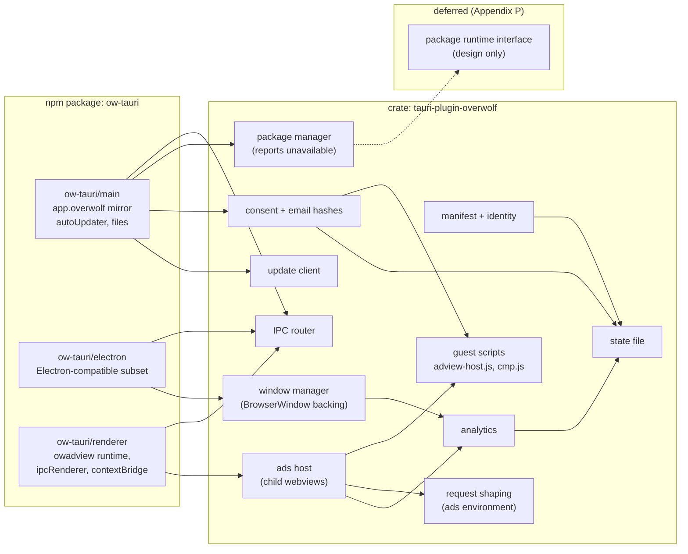
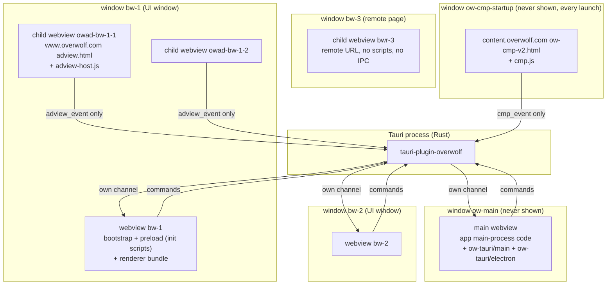
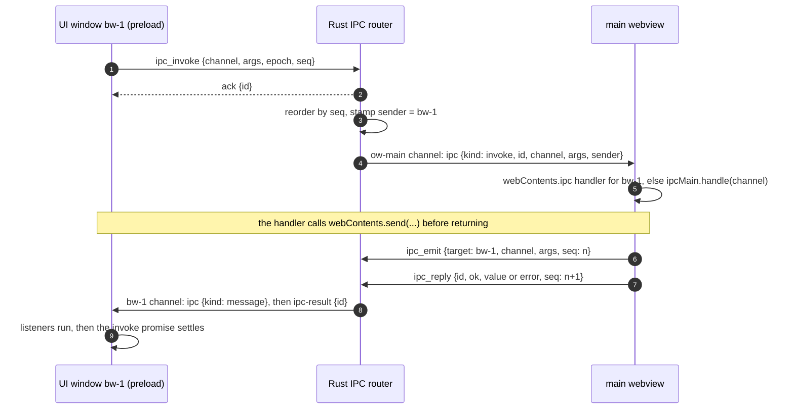
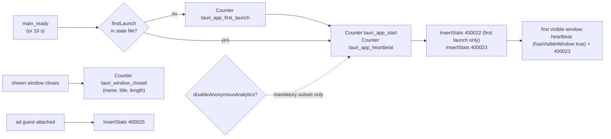
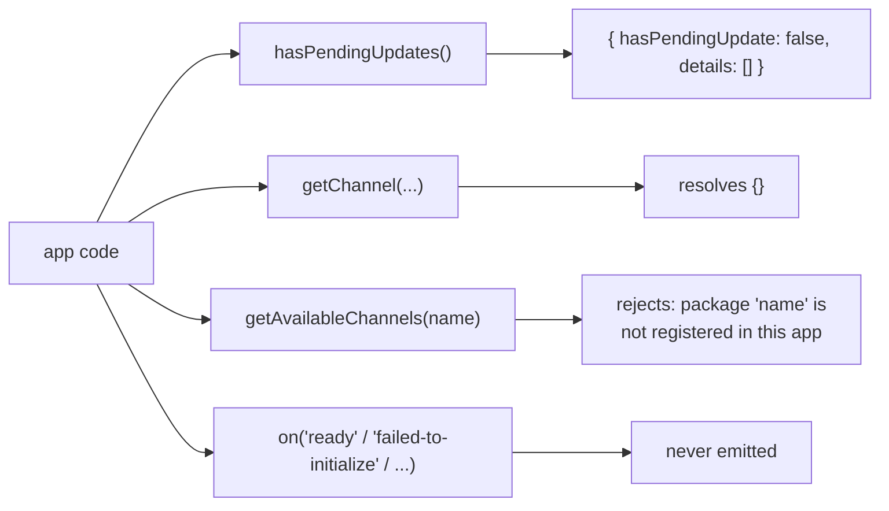
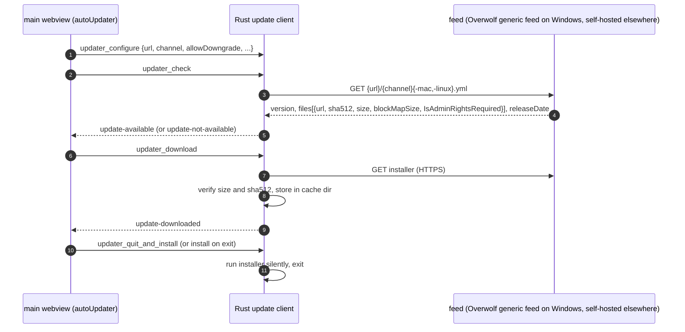

# ow-tauri architecture

This document describes how ow-tauri is built: its components, the process and
webview model, the main data flows and the security model. The precise wire
formats and API members are in [CONTRACT.md](CONTRACT.md); the reasons behind
each major choice are in the [ADRs](adr/).

Terminology:

- **ow-electron**: Overwolf's Electron fork. Its API is `app.overwolf` in the
  Electron main process, plus the `<owadview>` element in renderers.
- **Host**: the Tauri process (Rust) plus the webviews it owns.
- **Main webview**: the hidden, privileged webview that runs the app's former
  Electron main-process code.
- **UI window**: a visible window the app creates with `new BrowserWindow(...)`.
- **Guest**: a remote page the host embeds: an ad page or a consent page.
- **Package runtime**: the component that would run Overwolf packages (GEP,
  overlay, recorder, utility, CRN). None exists for any host but ow-electron
  on Windows; its interface is a deferred design (CONTRACT Appendix P).
- **Parity**: ow-tauri does what ow-electron does, on the wire and in the
  API, except for the host label (CONTRACT section 0,
  [PARITY.md](PARITY.md)).

## 1. Goals and non-goals

Goals:

1. An ow-electron app moves to Tauri 2 with mechanical changes: a bundler
   alias, a `src-tauri` crate, and a short list of documented edits.
2. **The ads system first.** `<owadview>` ads, the startup consent window,
   consent cookies, email hashes and the anonymous analytics behave as in
   ow-electron: same requests, same order, same identifiers. The parity
   harness proves it ([PARITY.md](PARITY.md)).
3. The only intended difference is the host label: `analytics.hostLabel`
   (default `"tauri"`) replaces `electron` in analytics names, the Overwolf
   version string and the user agent ([ADR 0006](adr/0006-analytics-labelling.md)).
4. `app.overwolf.packages` keeps its exact shape and reports packages as
   unavailable, exactly as ow-electron does where packages are not available
   ([ADR 0004](adr/0004-packages-backend-selection.md)).
5. The code is reviewable by Overwolf: small modules, full docs, typed errors,
   tests that never need a window or a network.

Non-goals:

- Running Node.js. The app's main-process code runs in a webview; Node
  built-ins are replaced ([PORT-MAP.md](PORT-MAP.md) section 3; the step-by-step
  guide is [MIGRATION.md](MIGRATION.md)).
- Overwolf's gaming packages (GEP, overlay, recorder, utility, CRN). They are
  deferred; the runtime interface is kept as a design appendix (CONTRACT
  Appendix P). There are no simulated backends.
- Faking Overwolf signing or integrity checks. `ow-tauri sign` runs
  Overwolf's published signing flow and stops where it would have to claim
  Electron integrity ([ADR 0016](adr/0016-signing-approach.md)).

## 2. Components



| Component | Lives in | Responsibility |
|---|---|---|
| manifest + identity | `crates/.../manifest`, `identity` | Read the embedded `package.json` (`overwolf`, `build.overwolf`, `productName`, `name`, `author`, `version`); compute the app uid with ow-electron's rule, honour the signed `overwolf.uid` (CONTRACT G.2); muid, muidV2 and phase percent from the machine id (CONTRACT E.4, [ADR 0014](adr/0014-machine-id-parity.md)). |
| state file | `state` | Read and write the per-app `ow-electron.json` with ow-electron's exact encoding, and `ow-tauri.json` (ow-tauri keys), atomically (CONTRACT F, [ADR 0007](adr/0007-state-file-continuity.md)). |
| IPC router | `ipc` | Route `ipcRenderer.invoke/send` from UI windows to `ipcMain` in the main webview, and `webContents.send` back, by webview label, over one ordered channel per webview ([ADR 0010](adr/0010-per-webview-ipc-channels.md)). |
| window manager | `window`, `host` | Create the windows behind the `BrowserWindow` facade, inject preload scripts, forward window events, enforce the window class of each webview. |
| ads host | `ads` | One native child webview per `<owadview>` element in the ads environment; layout, visibility, mute, popups, crash recovery, plain DOM events, host-to-guest messages; transparent guests, the interstitial raised above other guests and passing input through until it loads (CONTRACT B.3.4, [AD-FORMATS.md](AD-FORMATS.md)). |
| request shaping | `ads`, `platform/*` | The headers ow-electron sends for ad guests: `Referer` and `Origin` on the ad document, `Origin` on subresources, `x-ow-*` on `owads.min.js`, per OS (CONTRACT D.8, [ADR 0013](adr/0013-request-shaping-per-os.md)). |
| consent | `consent` | `isCMPRequired` from `cmp-eu-only`, the hidden startup consent window and the settings window, consent storage, the cookie fallback, ad sequencing; email hashes and the FPD switch (CONTRACT D.6, [ADR 0015](adr/0015-startup-consent-window.md)). |
| analytics | `analytics` | ow-electron's anonymous analytics (Counter and InsertStats requests) in the observed order, labelled through `analytics.hostLabel`, with the mandatory subset and the opt-outs (CONTRACT E). |
| package manager | `packages` | `app.overwolf.packages` as ow-electron reports it where packages are unavailable: no events, observed results (CONTRACT H). |
| update client | `updater` | electron-updater compatible: Overwolf's generic feed (Windows) or a self-hosted one, sha512 verification, install per OS; NSIS hooks for Overwolf's install and uninstall work (CONTRACT I). |
| injected scripts | `js/*.js` (built from `packages/ow-tauri/src/{bootstrap,guest}`, committed, embedded with `include_str!`) | the per-webview runtime bootstrap for `ow-main` and UI windows ([ADR 0012](adr/0012-js-runtime-singleton.md)); the 31-key `window.__overwolf__` for the ad page; `window.cmp` / `window.privacy` for both consent pages. |
| `ow-tauri sign` | the `ow-tauri` npm package (Node CLI) | Overwolf's published signing flow for a Tauri build (CONTRACT G.4, [ADR 0016](adr/0016-signing-approach.md)). |
| `ow-tauri/main` | `packages/ow-tauri/src/main` | `app.overwolf` with Node-style `EventEmitter` semantics; synchronous members served from a cache that Rust keeps up to date. |
| `ow-tauri/electron` | `packages/ow-tauri/src/electron` | The Electron subset that main-process and preload code import through the `electron` alias. |
| `ow-tauri/renderer` | `packages/ow-tauri/src/renderer` | `<owadview>` element runtime; `ipcRenderer` and `contextBridge` for preload code. |

The three npm entry points are facades over the bootstrap the plugin injects,
so each webview has exactly one runtime however many bundles import the
package ([ADR 0012](adr/0012-js-runtime-singleton.md)).

## 3. Process and webview model

ow-electron runs app code in two kinds of process: one Node main process and
one renderer per window. Tauri has one Rust process and webviews. ow-tauri maps
them as follows ([ADR 0001](adr/0001-hidden-main-webview.md)):



Ad guests and both consent windows run in the **ads environment**: their own
data store on Windows and browser arguments that turn web security off, as
ow-electron does for its guests (CONTRACT A.1.1, D.8.1). App windows run in
the app environment with the platform defaults.

### 3.1 Window classes

Every webview belongs to exactly one class. The class decides its label
pattern, what it may load and what it may call ([section 5](#5-security-model)).

| Class | Label pattern | Created by | Loads | Notes |
|---|---|---|---|---|
| main | `ow-main` | the plugin, at setup | app asset `plugins.overwolf.main.url` | Hidden. Never shown, never focused. One per app. |
| ui | `bw-<id>` | `new BrowserWindow(...)` with a local URL or file | app assets; remote documents only as frames, or on macOS and Linux after a script-driven top-level navigation, and then without IPC (navigation policy, CONTRACT A.2.3.1) | `<id>` is the Electron-style integer `BrowserWindow.id`; window and webview share the label. |
| overlay | reserved | none: `overlay.createWindow` needs a package runtime (CONTRACT H, Appendix P) | | Kept so a future runtime does not change the class table. |
| remote | webview `bwr-<id>` in window `bw-<id>` | `loadURL('http(s)://...')` on a `BrowserWindow` | any URL | No IPC, no initialization scripts, no capability. Loading a remote URL closes the app webview and creates this fresh child webview in the same window, because Tauri cannot remove initialization scripts from a webview. Never moves back. |
| adview-guest | `owad-<embedder>-<n>` | the ads host, per `<owadview>` | `https://www.overwolf.com/monsdk/electron/latest/adview.html` | Child webview inside the embedder's window; ads environment; requests shaped (CONTRACT D.8). |
| cmp-startup | `ow-cmp-startup` | the plugin, on every launch, when the `cmp-eu-only` request started at `RunEvent::Ready` completes | `https://content.overwolf.com/monsdk/electron/latest/cmp/22.3.27/ow-cmp-v2.html` | 1 x 32, never shown, not focusable; ads environment; closes itself (CONTRACT D.6.1). |
| cmp | `ow-cmp` | `openCMPWindow` / `openAdPrivacySettingsWindow` | `https://content.overwolf.com/monsdk/electron/latest/cmp/22.3.27/cmp.html` | Title `CMP`, 800 x 800; one at a time; ads environment (CONTRACT D.6.4). |
| cmp-default | `ow-cmp-default` | the first `openAdPrivacySettingsWindow` / `openCMPWindow` call of a launch | `https://content.overwolf.com/monsdk/electron/latest/cmp/22.3.27/ow-cmp-v2.html?unifiedcmp=&firstRun=true` | 1 x 32, never shown; writes a fresh default consent, as ow-electron does (CONTRACT D.6.4). |

### 3.2 Startup sequence

```mermaid
sequenceDiagram
  autonumber
  participant T as Tauri setup
  participant P as tauri-plugin-overwolf
  participant M as main webview (ow-main)
  participant U as UI window (bw-1)
  participant C as ow-cmp-startup (hidden)
  T->>P: Builder::build() setup hook
  P->>P: load embedded manifest, compute uid, muid, muidV2, phase
  P->>P: read state file, parse argv switches
  P->>M: create hidden window with init script __OW_TAURI_BOOTSTRAP__ (snapshot)
  T->>P: RunEvent::Ready
  P->>P: GET features.overwolf.com/experiments/cmp-eu-only (isCMPRequired)
  P->>C: when it completes: open ow-cmp-v2.html in the ads environment
  M->>M: bootstrap installs the runtime; app.overwolf built from the snapshot
  M->>P: ipc_subscribe(channel) -> epoch
  M->>M: app code runs top level (pre-ready calls, ipcMain.handle, ...)
  M->>P: ipc_main_ready, main_ready
  P->>P: analytics: first launch, start, heartbeat, 400022, 400023 (in order)
  C->>C: page stores consent, writes euconsent-v2 / acconsent cookies
  C->>P: cmp_event {name: close}
  M->>M: app.whenReady() resolves; app creates its windows
  M->>P: window_create {preload, options}, window_load {url}
  P->>U: create window, bootstrap + preload as init scripts, load URL
  U->>P: ipc_subscribe(channel), then ipc_invoke / adview_mount ...
```

Two details matter for parity with ow-electron:

- **Pre-ready calls.** `disableAnonymousAnalytics()` must be called before
  `app.ready` in ow-electron. ow-tauri starts the analytics sequence when the
  main webview reports `main_ready` (or after 10 s), so a top-level call in
  the app's main code is honoured. The consent window and `cmp-eu-only` start
  earlier, at `RunEvent::Ready`, as in ow-electron (CONTRACT E.2).
- **Synchronous members.** `uid`, `muid`, `phasePercent`, `utmParams`,
  `packages.hasPendingUpdates()`, `screen.getAllDisplays()`, `app.getPath()` and
  others are synchronous in Electron. The plugin injects a snapshot into the
  main webview before any script runs and pushes ordered patches afterwards
  (CONTRACT section B.1.6).

### 3.3 Liveness and lifecycle of the main webview

Engines throttle hidden webviews, and `ow-main` must keep running like
Electron's main process. The plugin gives every webview one browser-argument
set that disables background throttling on Windows, disables it through
Tauri on macOS 14+, and keeps `ow-main` as a 1 x 1 transparent, technically
visible window on macOS 12 and 13 and on Linux. A scheduled soak test checks
timer cadence on all three platforms. In release builds `ow-main` cannot
navigate; a crash relaunches the app (bounded, the crash times kept in
`ow-tauri.json`), and every exit path runs one quit sequence with
`before-quit` and `will-quit`. Relaunches start at `RunEvent::Exit`, after
the app's single-instance plugin has released its lock. On macOS the app
forwards web-content process terminations of `ow-main` to the plugin,
because Tauri exposes that hook only on the app's builder. Details: CONTRACT
A.6 and [ADR 0009](adr/0009-main-webview-liveness-and-lifecycle.md).

## 4. Data flows

### 4.1 IPC routing

`ipcRenderer.invoke` in a UI window reaches `ipcMain.handle` in the main
webview with the same channel string. Rust is the router: it stamps the sender
(label, window id, URL) from the calling webview, so a renderer cannot spoof
another window. Each webview receives host messages only on the channel it
subscribed itself, so no webview can observe another's traffic
([ADR 0010](adr/0010-per-webview-ipc-channels.md)).



Details (request ids, timeouts, the tagged JSON codec, error mapping) are in
CONTRACT section C.

### 4.2 Ads lifecycle

```mermaid
sequenceDiagram
  autonumber
  participant A as app renderer
  participant R as ow-tauri/renderer
  participant P as Rust ads host
  participant G as guest owad-bw-1-1 (adview.html)
  A->>R: el = document.createElement('owadview') (upgraded at creation)
  A->>A: el.setAttribute(...); container.appendChild(el)
  R->>R: default style fills the container; Resize/IntersectionObserver start
  R->>P: adview_mount {elementId, attributes, rect, visible}
  P->>G: add child webview at rect (ads environment), init script adview-host.js + config
  P->>R: channel: adview-event {did-attach}
  P->>P: analytics: InsertStats 400025
  P->>P: first navigation waits for ow-cmp-startup to close (at most 3 s after mount)
  P->>G: load adview.html with Referer / Origin (request shaping, D.8)
  G->>P: adview_event {name: impression}
  P->>R: channel: adview-event {elementId, name}
  R->>A: el.dispatchEvent(new Event('impression')) with data as own properties
  A->>A: high-impact: container grows to the zone
  R->>P: adview_update {rect}
  P->>G: move and resize child webview
  G->>P: popup / click navigation
  P->>P: opener opens system browser
  P->>G: deliver {type: ad-clicked}
  P->>R: channel: adview-event {ad-clicked, url}
  A->>R: container.removeChild(el)
  R->>P: adview_unmount {elementId}
  P->>G: close child webview
```

Visibility: the element is "visible" when its window is shown, it is
connected, at least half of it intersects the viewport, no ancestor hides it,
and the document is visible. When it is not visible, the guest webview is
hidden (not destroyed), and the guest is told so the way ow-electron tells
it (its `document.visibilityState`, plus a `window-hidden` message when the
window hides); the ad page then reloads itself until it is visible again.
Guests also receive ow-electron's `consent`, `customTracking` and `eHashes`
messages (CONTRACT D.5). A guest's `consent` and `consentFull` start as the
unified consent string stored at launch (empty on a first launch), and the
documents of a window's guests become hidden just before the window is
destroyed, both as in ow-electron (observed). `setUserEmailHashes()` also
stores the hashes as `eHashes` in `ow-electron.json`, as ow-electron does
(observed). A crashed guest is reloaded at once, without a cap
(CONTRACT D.7).

### 4.3 Consent

Two windows, both in the ads environment
([ADR 0015](adr/0015-startup-consent-window.md), CONTRACT D.6):

```mermaid
sequenceDiagram
  autonumber
  participant P as Rust consent
  participant F as features.overwolf.com
  participant C as ow-cmp-startup (ow-cmp-v2.html + cmp.js)
  participant S as state file
  participant K as ads data store (cookies)
  participant G as ad guests
  P->>F: GET /experiments/cmp-eu-only
  F-->>P: response (any outcome; no client timeout)
  P->>C: open hidden 1 x 32 window (unifiedcmp, muid, uid, muidv2, oweVersion, appVersion)
  C->>C: first launch: default Full consent; later: stored consent
  C->>P: cmp.saveUnifiedConsent / privacy.* (cmp_event)
  P->>S: write cmp.* with ow-electron's encoding (ow-electron.json)
  C->>K: euconsent-v2, acconsent on .overwolf.com (365 days)
  C->>P: cmp_event {name: close}
  P->>G: consent message x2 to existing guests (TCF, then unified string)
  P->>K: only if both cookies are missing: write them (hostCookieFallback)
  P->>G: release first navigations (or 3 s after mount)
  G->>K: ad page reads consent from the cookies
```

`openAdPrivacySettingsWindow()` and `openCMPWindow()` open the settings window
`ow-cmp` (title `CMP`, a preloader, then `cmp.html`) and resolve once it
exists; the first call of a launch also opens the hidden `ow-cmp-default`
window, which writes a fresh default consent exactly as ow-electron does
(OQ-38). Pages save through the same globals, rewrite the cookies, and each
save sends the guests a `consent` message; the ad page also reads the
cookies. `isCMPRequired()` awaits the `cmp-eu-only` request and the startup
page's load, with no timeout, and resolves `true` (CONTRACT D.6).

### 4.4 Analytics

Analytics run in Rust only and send exactly ow-electron's requests, in its
order, with `<label>` (default `tauri`) where ow-electron says `electron`
([ADR 0006](adr/0006-analytics-labelling.md)). The request shapes (Counter
query order `Name, MUID, MUIDV2, owver, Extra`; InsertStats
`Extra = <app_ver>.<uid>.<os>.<PN>.<cuid>`), the mandatory subset and the
opt-outs are in CONTRACT section E.



The diagram shows the default label `tauri`. The user agent of every host
request, ad guest and consent window is the platform webview's user agent
with `<Label>/<hostVersion>` in place of Electron's token (CONTRACT E.1).
The WKWebView default has no browser product tokens, and ad stacks rate
such a user agent as an unknown browser and serve it no demand, so on macOS
Safari's own tokens are added where Electron keeps Chromium's
(`<PNNS>/<ver> Version/<safari> Tauri/<tv> Safari/<webkit>`, the version
read from the installed Safari). The engine is never changed.

Host requests go out through a plain hyper client (system proxy, TLS with
ALPN, gzip/deflate/br/zstd decoding), so the wire carries exactly the
headers ow-electron sends, in its order (observed): `content-length` first
on InsertStats, no `accept`, and no cookies (ow-electron's host session
sends none and stores none). Requests start in call order without waiting
for each other's responses, so a burst leaves together as in ow-electron.
There is no HTTP cache: where ow-electron revalidates a URL its Chromium
cache holds from an earlier launch (`if-none-match`, answered `304`),
ow-tauri sends the plain request, which reaches the same server
(optimised, same outcome).

### 4.5 Packages

Packages are out of scope ([ADR 0004](adr/0004-packages-backend-selection.md)).
On every OS, `app.overwolf.packages` behaves as ow-electron does where
packages are not available (CONTRACT H.1):



`packagesBackend` is `none`; `native` is reserved for a runtime that
implements the deferred design in CONTRACT Appendix P.

### 4.6 Updater



Overwolf's feed is
`https://electron-updates.overwolf.com/electron-updates/electron/<uid>` and
serves Windows setup files only; macOS and Linux use a self-hosted feed with
the same YAML shape. The Tauri NSIS installer carries hooks that do the
install and uninstall work of Overwolf's NSIS installer, including the
`ow_<label>_app_uninstall` Counter (CONTRACT I.6).

## 5. Security model

The threat model and reporting process are in [SECURITY.md](../SECURITY.md);
this section is the design.

### 5.1 Principles

1. **Least privilege per webview class.** Only the main webview can reach the
   host APIs. UI windows can reach the IPC router and the ads commands. Remote
   pages get nothing, except that each Overwolf guest page gets one scoped,
   rate-limited command ([ADR 0011](adr/0011-remote-guest-ipc.md)).
2. **The sender is the label.** Every command takes the calling `Webview` from
   Tauri and uses its label as the identity. Payload fields that claim an
   identity are ignored (and logged when they disagree).
3. **No webview observes another.** Rust sends to a webview only through the
   channel that webview subscribed itself; Tauri events are not used
   ([ADR 0010](adr/0010-per-webview-ipc-channels.md)).
4. **Remote pages never get app code or IPC.** Ads and consent run in their
   own webviews; their scripts run only in the main frame of their own
   origin. A `BrowserWindow` that loads a remote URL gets a fresh webview
   with no initialization scripts. Every app script is origin-guarded and the
   UI capability is local-only, so a remote document that does end up in an
   app webview (an embedded frame, or on macOS and Linux a script-driven
   top-level navigation the engine cannot tell from a frame) runs no app
   code and can call no command (CONTRACT A.2.3.1).
5. **No shell strings, no blind execution.** URLs and paths go through the
   opener plugin; URLs are parsed and limited to `http`, `https` and `mailto`;
   `shell.openPath` is limited to the file scope and refuses executables by
   default (CONTRACT A.2.3.2).
6. **Updates are signature-checked, failing closed** (CONTRACT I.3,
   [ADR 0008](adr/0008-updater-client.md)).
7. **Tauri 2.12.1.** GHSA-w28w-mhc8-qvjv: Tauri's channel-data fetch command
   skipped the ACL check, and queued channel payloads and large invoke
   responses could be fetched by other webviews (patched in 2.11.6 and 2.12.0).
   It matters here because ow-tauri places remote ad and consent webviews next
   to app webviews and moves all host traffic over channels.

### 5.2 Capabilities

Tauri applies a capability to a webview when **either** the window label or
the webview label matches one of its patterns, and it applies app commands
(those an app registers with `invoke_handler`) to every local webview unless
the app declares an app manifest. ow-tauri therefore:

- writes every capability with `webviews` label patterns only, never
  `windows`, so a child webview inside a `bw-*` window (an ad guest
  `owad-bw-1-1`, a remote page `bwr-1`) does not inherit the window's
  capability;
- states `"local": true` or the exact `remote.urls` on every capability;
- grants no `core:event:*` permission anywhere;
- asks apps to declare their own commands with
  `tauri_build::AppManifest::commands` and scope them with their own
  capability (MIGRATION.md, SECURITY.md).

The plugin's own capabilities are added at runtime with
`Manager::add_capability`, so an app cannot forget them. The app's capability
file grants `overwolf:renderer` to its UI webviews. `overwolf:default` is empty:
the plugin grants nothing to a webview unless a capability below names it.

| Class | Capability (who adds it) | Webviews | Permission sets | Origin |
|---|---|---|---|---|
| main | `ow-tauri-main` (plugin) | `ow-main` | `overwolf:main`, `core:app:default`, `core:path:default`, `core:window:default`, `core:webview:default`, and the `core:window:allow-*` / `core:webview:allow-*` commands the `BrowserWindow` facade calls (named in the runtime capability itself, not through a permission set); no `core:event:*` | `local: true` |
| ui | the app (template in `examples/packages-sample/src-tauri/capabilities/ui.json`) | `bw-*` | `overwolf:renderer` | `local: true` |
| ui-chrome | `ow-tauri-ui-chrome` (plugin) | `bw-*` | `core:window:allow-start-dragging`, `core:window:allow-toggle-maximize` (for `app-region: drag`, CONTRACT B.3.6) | `local: true` |
| remote | none | `bwr-*` | none | |
| adview-guest | `ow-tauri-adview-guest` (plugin) | `owad-*` | `overwolf:adview-guest` (one command: `adview_event`) | `https://www.overwolf.com/monsdk/electron/*` |
| cmp-startup, cmp-default, cmp | `ow-tauri-cmp` (plugin) | `ow-cmp-startup`, `ow-cmp-default`, `ow-cmp` | `overwolf:cmp-window` (one command: `cmp_event`) | `https://content.overwolf.com/monsdk/electron/*` |

The opener, dialog and global-shortcut plugins are called from Rust only; no
webview holds their permissions. The plugin registers them unless the app
already did, from a task its setup hook posts to the event loop (Tauri holds
its plugin-store lock during setup, so registering inside the hook
deadlocks). `tauri-plugin-single-instance` must be the first
plugin an app registers, so the app registers it and forwards to
`Overwolf::emit_second_instance` (CONTRACT A.5).

Enforcement is defence in depth: every command also checks the caller's
class and returns `forbidden` when it does not match (a `bw-*` caller must be
a window the plugin created with `window_create`), so a mis-scoped
capability cannot widen access. The plugin's test suite runs the full matrix
on Tauri's mock runtime: every command against every class, including a child
webview inside a `bw-*` window and a remote page in a `bw-*` window.

### 5.3 Remote content rules

- Ad guests: no new windows (popups go to the system browser and the guest is
  told `ad-clicked`); top-level navigation away from Overwolf hosts is blocked
  unless it follows a reported gesture inside the guest, in which case it
  opens in the system browser instead; one external open per gesture and a
  per-minute cap; started muted; per-guest rate limits on events and bytes
  (CONTRACT D.4, D.7).
- Consent windows: navigation limited to Overwolf hosts; `window.close()` is
  routed to the host; a hidden consent page that never closes itself is
  closed after `consent.readyTimeoutMs`.
- **Web security off in the ads environment.** ow-electron runs its guests
  with web security disabled and insecure content allowed; ow-tauri does the
  same for ad guests and consent windows only (on Windows through the ads
  environment's browser arguments, on Linux per webview; macOS has no public
  API and keeps it on). These webviews run no app code, receive no
  initialization scripts but the guest shim, and hold one command each, so
  turning web security off exposes no host API (CONTRACT A.1.1, D.8.1,
  [ADR 0013](adr/0013-request-shaping-per-os.md)).
- Remote BrowserWindows: a fresh `bwr-*` webview with no IPC, no preload and no
  initialization scripts. The sample's injected drag header is replaced (see
  [PORT-MAP.md](PORT-MAP.md)).

### 5.4 Data protection

- The muid is derived from the machine id exactly as ow-electron does
  (hashed, never logged); `per-install` is an option
  ([ADR 0014](adr/0014-machine-id-parity.md)).
- The ad page's `systemInfo` carries what ow-electron gives it: the CPU
  brand, GPU entries and display names, and nothing else (CONTRACT D.2).
- Logging is off by default, as in ow-electron (CONTRACT F.4).
- Email addresses are hashed in memory and never stored; ow-tauri never scans
  user data for email addresses.
- Consent strings are validated (printable ASCII, size cap) before they are
  stored or delivered.

### 5.5 Content Security Policy

Initialization scripts and page scripts share one JavaScript world in a
Tauri webview, and `__TAURI_INTERNALS__.invoke` is a page global. Any script
that runs in a UI window can therefore call every command that window may
call, including `ipc_invoke` on every channel. A CSP is the main defence
against script injection, so ow-tauri documents a baseline per class and the
example ships it in `tauri.conf.json` (`app.security.csp`). The example does
not set `app.security.freezePrototype`: Tauri injects it into every webview,
ad guests and consent pages included, whose third-party scripts ow-tauri does
not change.

| Class | Baseline CSP |
|---|---|
| main | `default-src 'self'; script-src 'self'; connect-src 'self' ipc: http://ipc.localhost <hosts the app's main code fetches>; img-src 'self' data:; style-src 'self'; object-src 'none'; base-uri 'none'; frame-ancestors 'none'` |
| ui | as main, plus what the app's pages need (the sample: `style-src 'self' 'unsafe-inline' https://fonts.googleapis.com; font-src https://fonts.gstatic.com`) |
| remote, guests | the remote page's own CSP; ow-tauri adds none |

No class needs `unsafe-eval`: `executeJavaScript` runs through the platform's
native script evaluation, not page `eval` (CONTRACT A.2.3). ow-tauri's own
scripts are injected by the webview as initialization scripts, not as page
`<script>` elements, so the baseline does not have to allow them.

## 6. Platform notes

| Concern | Windows (WebView2) | macOS (WKWebView) | Linux (WebKitGTK) |
|---|---|---|---|
| Child webviews (`Window::add_child`) | yes, needs Tauri `unstable` | yes, needs Tauri `unstable` | yes, needs Tauri `unstable` |
| Main webview liveness (A.6) | shared browser arguments disable background throttling | macOS 14+: `BackgroundThrottlingPolicy::Disabled`; 12 and 13: 1 x 1 visible window, transparent only with Tauri's `macOSPrivateApi` | 1 x 1 transparent visible window |
| Main webview crash signal (A.6) | `ProcessFailed` | web-content termination, forwarded by the app (`report_web_content_terminated`) | `web-process-terminated` |
| Navigation hook (A.2.3.1) | top-level navigations only: external links cancelled and opened in the system browser | also sees frames: external `http(s)` allowed; the bootstrap intercepts top-level link clicks and form submissions | as macOS |
| Browser arguments (A.1.1) | one set per webview environment (app, ads), because WebView2 requires one set per data directory | none | none |
| Guest mute | `ICoreWebView2_8::put_IsMuted` | private `_setPageMuted:` guarded by `respondsToSelector:` (risk below) | `webkit_web_view_set_is_muted` |
| Guest crash detection | `ProcessFailed` | `on_web_content_process_terminate` | `web-process-terminated` |
| User-initiated popups | `NewWindowRequested.IsUserInitiated` | gesture window only | gesture window only |
| Request shaping (D.8) | full: `WebResourceRequested` on every guest request | ad document only (`load(URLRequest)`); subresource `Origin` and `x-ow-*` have no public API: a known gap | ad document only; subresources need a web-process extension (deferred) |
| Web security off for guests (D.8.1) | ads environment browser arguments | no public API: stays on (gap) | `enable-web-security` off per webview |
| Ads data store (A.1.1) | own user data folder `EBWebView-ow` | default data store | default context |
| Machine id source (E.4) | registry `MUID` / `MUIDV2`, else `MachineGuid` | `IOPlatformUUID` | `/etc/machine-id` |
| Overwolf update feed (I.1) | yes | no (self-hosted feed) | no (self-hosted feed) |
| Frameless window dragging | `app-region` emulation in `ow-tauri/renderer` | `frame:false` maps to an overlay title bar | `app-region` emulation where exposed |
| Packages (H) | reported unavailable | reported unavailable | reported unavailable |

Risks we track:

- **Tauri `unstable`.** Child webviews are behind Tauri's `unstable` feature,
  whose APIs may change in a 2.x minor release. The plugin enables it; a
  scheduled CI job builds against the newest 2.x.
- **macOS private selector.** Muting a guest on macOS uses WebKit's private
  `_setPageMuted:`. It is guarded at runtime and can disappear in any macOS
  release; it may also raise App Store review questions. Without it, guests
  are not muted on macOS.
- **macOS request shaping gap.** macOS ad guests send the shaped ad document
  request but not ow-electron's subresource headers, and keep web security
  on. The lab check in [PARITY.md](PARITY.md#lab-checks) measures the effect
  on fill; a private-API prototype stays off by default (`ads.macPrivateHeaderApi`).
- **Native guest mechanics.** What an in-page guest gets for free is rebuilt
  per platform (CONTRACT B.3.4): transparency (on macOS through the
  `drawsBackground` key-value key, guarded by `respondsToSelector:`, and the
  public `underPageBackgroundColor`), stacking (`SetWindowPos`,
  `addSubview:positioned:relativeTo:`) and input pass-through (an empty
  window region on Windows; on macOS a `hitTest:` replaced once on the web
  view's own class). A WebKit or WebView2 change can break one of them; the
  lab's `transparent-native`, `zorder-native` and `passthrough-native`
  records catch it.
- **Linux overlap.** tauri-runtime-wry packs child webviews into a `GtkBox`,
  so ad guests never overlap the page: ad rectangles, stacking and
  pass-through do not apply on Linux.

## 7. Repository layout and build

```
crates/tauri-plugin-overwolf/
  src/        lib.rs, plugin.rs (Builder, setup, run events), ext.rs (Rust API),
              error.rs, config.rs, manifest.rs, identity.rs, paths.rs,
              snapshot.rs, capabilities.rs, shell.rs, screen.rs, ...,
              commands/ (one file per area), host/ (runtime state, main
              webview, windows), ipc/ (router, reorder buffer, messages),
              window/, state/ (ow-electron.json, ow-tauri.json, log),
              ads/, consent/, analytics/, packages/, updater/,
              platform/{windows,unix}.rs, build.rs
  js/         bootstrap.js, adview-host.js, cmp.js: built from
              packages/ow-tauri/src/{bootstrap,guest}, committed, embedded
              with include_str!, checked for drift in CI
  permissions/ default.toml (empty) + set definitions
packages/ow-tauri/src/
  bootstrap/ guest/ main/ electron/ renderer/ shared/ types/
examples/packages-sample/
  src/ (upstream tree, ported), src-tauri/ (thin app using the plugin)
examples/ad-showcase/
  one renderer for both hosts: every ad format, on ow-electron and ow-tauri
tools/parity-harness/
  runs ow-electron and ow-tauri side by side and compares the wire
docs/
```

The app's `build.rs` calls `tauri_plugin_overwolf::build::embed_manifest`,
which reads `package.json`, validates the `overwolf` and `build.overwolf`
blocks and writes the embedded manifest (CONTRACT section G).
