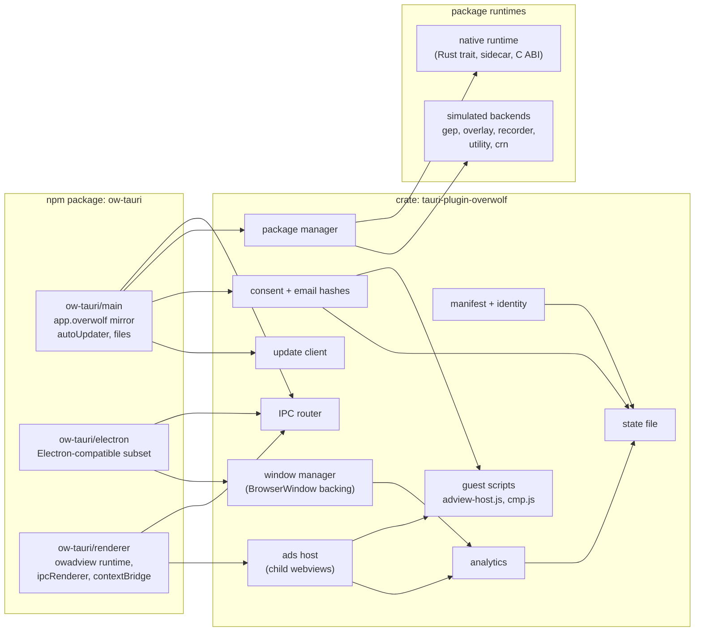
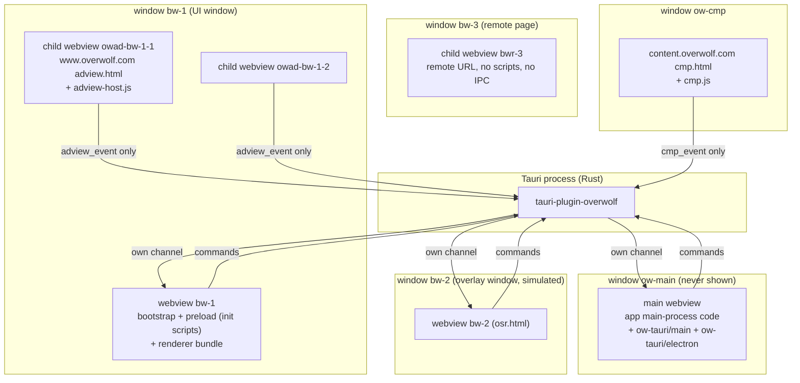
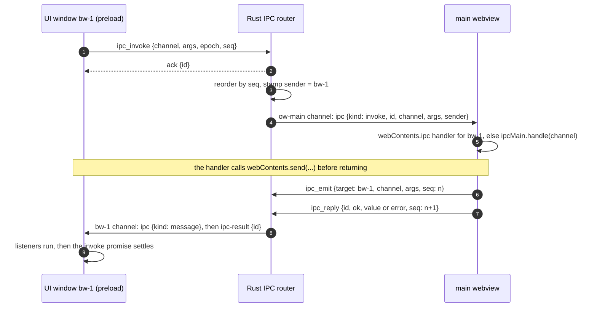
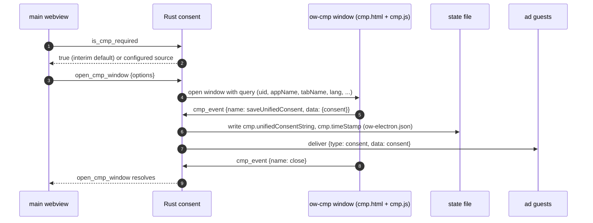
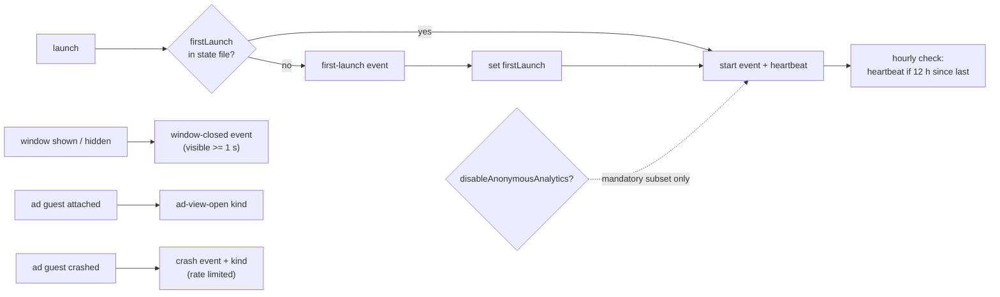
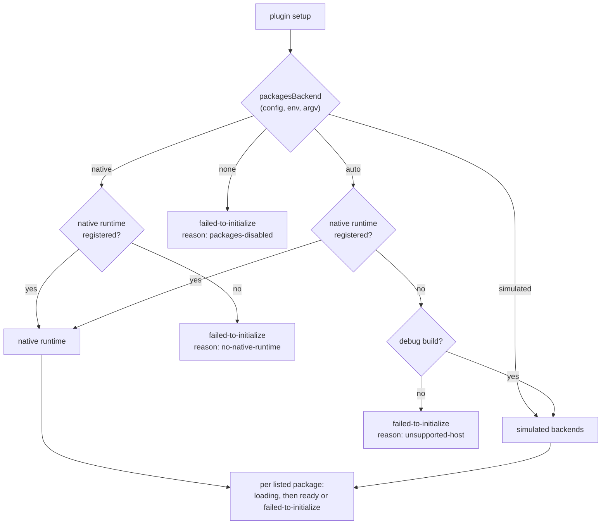
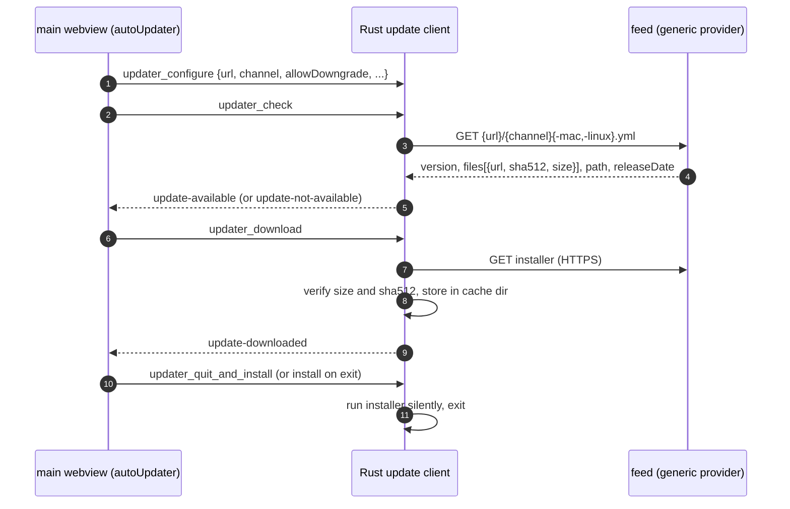

# ow-tauri architecture

This document describes how ow-tauri is built: its components, the process and
webview model, the main data flows and the security model. The precise wire
formats and API members are in [CONTRACT.md](CONTRACT.md); the reasons behind
each major choice are in the [ADRs](adr/).

Terminology:

- **ow-electron**: Overwolf's Electron fork. Its API is `app.overwolf` in the
  Electron main process, plus the `<owadview>` element in renderers.
- **Host**: the Tauri process (Rust) plus the webviews it owns.
- **Main webview**: the hidden, privileged webview that runs the app's former
  Electron main-process code.
- **UI window**: a visible window the app creates with `new BrowserWindow(...)`.
- **Guest**: a remote page the host embeds: an ad page or the consent page.
- **Package runtime**: the component that actually runs Overwolf packages
  (GEP, overlay, recorder, utility, CRN).

## 1. Goals and non-goals

Goals:

1. An ow-electron app moves to Tauri 2 with mechanical changes: a bundler
   alias, a `src-tauri` crate, and a short list of documented edits.
2. Overwolf monetisation keeps working: `<owadview>` ads, consent, email
   hashes, anonymous analytics.
3. `app.overwolf.packages` keeps its exact shape so that, the day Overwolf ships
   a host-agnostic package runtime, gaming features light up without app changes.
4. Everything ow-tauri sends to Overwolf is honestly labelled as coming from a
   Tauri host.
5. The code is reviewable by Overwolf: small modules, full docs, typed errors,
   tests that never need a window or a network.

Non-goals:

- Running Node.js. The app's main-process code runs in a webview; Node
  built-ins are replaced ([PORT-MAP.md](PORT-MAP.md) section 3; the step-by-step
  guide will be `docs/MIGRATION.md`).
- Re-implementing Overwolf's native packages. ow-tauri defines the interface a
  native runtime implements and ships simulated backends for development.
- Faking Overwolf signing or integrity checks.

## 2. Components



| Component | Lives in | Responsibility |
|---|---|---|
| manifest + identity | `crates/.../manifest`, `identity` | Read the embedded `package.json` (`overwolf`, `build.overwolf`, `productName`, `author`, `version`); compute the app uid, honour a console-assigned uid override; muid and phase percent. |
| state file | `state` | Read and write the per-app `ow-electron.json` (shared keys) and `ow-tauri.json` (ow-tauri keys), atomically. |
| IPC router | `ipc` | Route `ipcRenderer.invoke/send` from UI windows to `ipcMain` in the main webview, and `webContents.send` back, by webview label, over one ordered channel per webview ([ADR 0010](adr/0010-per-webview-ipc-channels.md)). |
| window manager | `window` | Create the windows behind the `BrowserWindow` facade, inject preload scripts, forward window events, enforce the window class of each webview. |
| ads host | `adview` | One native child webview per `<owadview>` element; layout, visibility, mute, popups, crash recovery, host-to-guest messages. |
| consent | `consent` | `isCMPRequired`, consent windows, consent storage, propagation to guests; email hashes and the FPD and ad-optimisation switches. |
| analytics | `analytics` | Anonymous app analytics (Counter and InsertStats requests) with the mandatory subset and the opt-outs. |
| package manager | `packages` | `app.overwolf.packages`: lifecycle events, channels, pending updates; dispatch to the selected package runtime. |
| package runtimes | `packages::runtime`, `packages::sim` | `PackageRuntime` trait, the JSON-RPC sidecar and C-ABI adapters, and the simulated backends. |
| update client | `updater` | electron-updater compatible: generic feed, sha512 verification, install per OS. |
| injected scripts | `js/*.js` (built from `packages/ow-tauri/src/{bootstrap,guest}`, committed, embedded with `include_str!`) | the per-webview runtime bootstrap for `ow-main` and UI windows ([ADR 0012](adr/0012-js-runtime-singleton.md)); `window.__overwolf__` for the ad page; `window.cmp` / `window.privacy` for the consent page. |
| `ow-tauri/main` | `packages/ow-tauri/src/main` | `app.overwolf` with Node-style `EventEmitter` semantics; synchronous members served from a cache that Rust keeps up to date. |
| `ow-tauri/electron` | `packages/ow-tauri/src/electron` | The Electron subset that main-process and preload code import through the `electron` alias. |
| `ow-tauri/renderer` | `packages/ow-tauri/src/renderer` | `<owadview>` element runtime; `ipcRenderer` and `contextBridge` for preload code. |

The three npm entry points are facades over the bootstrap the plugin injects,
so each webview has exactly one runtime however many bundles import the
package ([ADR 0012](adr/0012-js-runtime-singleton.md)).

## 3. Process and webview model

ow-electron runs app code in two kinds of process: one Node main process and
one renderer per window. Tauri has one Rust process and webviews. ow-tauri maps
them as follows ([ADR 0001](adr/0001-hidden-main-webview.md)):



### 3.1 Window classes

Every webview belongs to exactly one class. The class decides its label
pattern, what it may load and what it may call ([section 5](#5-security-model)).

| Class | Label pattern | Created by | Loads | Notes |
|---|---|---|---|---|
| main | `ow-main` | the plugin, at setup | app asset `plugins.overwolf.main.url` | Hidden. Never shown, never focused. One per app. |
| ui | `bw-<id>` | `new BrowserWindow(...)` with a local URL or file | app assets only (navigation policy, CONTRACT A.2.3.1) | `<id>` is the Electron-style integer `BrowserWindow.id`; window and webview share the label. |
| overlay | `bw-<id>` | `overlay.createWindow(...)` (simulated backend) | app assets only | Same capabilities as `ui`; extra overlay state in the package runtime. |
| remote | webview `bwr-<id>` in window `bw-<id>` | `loadURL('http(s)://...')` on a `BrowserWindow` | any URL | No IPC, no initialization scripts, no capability. Loading a remote URL closes the app webview and creates this fresh child webview in the same window, because Tauri cannot remove initialization scripts from a webview. Never moves back. |
| adview-guest | `owad-<embedder>-<n>` | the ads host, per `<owadview>` | `https://www.overwolf.com/monsdk/electron/latest/adview.html` | Child webview inside the embedder's window. |
| cmp | `ow-cmp` | `openCMPWindow` / `openAdPrivacySettingsWindow` | `https://content.overwolf.com/monsdk/electron/latest/cmp/...` | One at a time. |

### 3.2 Startup sequence

```mermaid
sequenceDiagram
  autonumber
  participant T as Tauri setup
  participant P as tauri-plugin-overwolf
  participant M as main webview (ow-main)
  participant U as UI window (bw-1)
  T->>P: Builder::build() setup hook
  P->>P: load embedded manifest, compute uid, muid, phase
  P->>P: read state file, parse argv switches, select packages backend
  P->>M: create hidden window with init script __OW_TAURI_BOOTSTRAP__ (snapshot)
  M->>M: bootstrap installs the runtime; app.overwolf built from the snapshot
  M->>P: ipc_subscribe(channel) -> epoch
  M->>M: app code runs top level (pre-ready calls, ipcMain.handle, ...)
  M->>P: ipc_main_ready, main_ready
  P->>P: analytics start (first launch, start, heartbeat); packages start loading
  M->>M: app.whenReady() resolves; app creates its windows
  M->>P: window_create {preload, options}, window_load {url}
  P->>U: create window, bootstrap + preload as init scripts, load URL
  U->>P: ipc_subscribe(channel), then ipc_invoke / adview_mount ...
```

Two details matter for parity with ow-electron:

- **Pre-ready calls.** `disableAnonymousAnalytics()` must be called before
  `app.ready` in ow-electron. ow-tauri holds analytics until the main webview
  reports `main_ready` (or until a timeout), so a top-level call in the app's
  main code is honoured.
- **Synchronous members.** `uid`, `muid`, `phasePercent`, `utmParams`,
  `packages.hasPendingUpdates()`, `screen.getAllDisplays()`, `app.getPath()` and
  others are synchronous in Electron. The plugin injects a snapshot into the
  main webview before any script runs and pushes ordered patches afterwards
  (CONTRACT section B.1.6).

### 3.3 Liveness and lifecycle of the main webview

Engines throttle hidden webviews, and `ow-main` must keep running like
Electron's main process. The plugin gives every webview one browser-argument
set that disables background throttling on Windows, disables it through
Tauri on macOS 14+, and keeps `ow-main` as a 1 x 1 transparent, technically
visible window on macOS 12 and 13 and on Linux. A scheduled soak test checks
timer cadence on all three platforms. In release builds `ow-main` cannot
navigate; a crash relaunches the app (bounded), and every exit path runs one
quit sequence with `before-quit` and `will-quit`. Details: CONTRACT A.6 and
[ADR 0009](adr/0009-main-webview-liveness-and-lifecycle.md).

## 4. Data flows

### 4.1 IPC routing

`ipcRenderer.invoke` in a UI window reaches `ipcMain.handle` in the main
webview with the same channel string. Rust is the router: it stamps the sender
(label, window id, URL) from the calling webview, so a renderer cannot spoof
another window. Each webview receives host messages only on the channel it
subscribed itself, so no webview can observe another's traffic
([ADR 0010](adr/0010-per-webview-ipc-channels.md)).



Details (request ids, timeouts, the tagged JSON codec, error mapping) are in
CONTRACT section C.

### 4.2 Ads lifecycle

```mermaid
sequenceDiagram
  autonumber
  participant A as app renderer
  participant R as ow-tauri/renderer
  participant P as Rust ads host
  participant G as guest owad-bw-1-1 (adview.html)
  A->>R: el = document.createElement('owadview') (upgraded at creation)
  A->>A: el.setAttribute(...); container.appendChild(el)
  R->>R: default style fills the container; Resize/IntersectionObserver start
  R->>P: adview_mount {elementId, attributes, rect, visible}
  P->>P: wait for consent readiness (first mount only)
  P->>G: add child webview at rect, init script adview-host.js + config
  P->>P: analytics: ad view opened
  G->>P: adview_event {name: impression}
  P->>R: channel: adview-event {elementId, name}
  R->>A: el.dispatchEvent(new CustomEvent('impression'))
  A->>A: high-impact: container grows to the zone
  R->>P: adview_update {rect}
  P->>G: move and resize child webview
  G->>P: popup / click navigation
  P->>P: opener opens system browser
  P->>G: deliver {type: ad-clicked}
  A->>R: container.removeChild(el)
  R->>P: adview_unmount {elementId}
  P->>G: close child webview
```

Visibility: the element is "visible" when it is connected, at least half of it
intersects the viewport, no ancestor hides it, and the document is visible.
When it is not visible, the guest webview is hidden (not destroyed). Rust also
tells guests when their window is minimized or hidden.

### 4.3 Consent



Consent changes are delivered to running guests; guests are not recreated, so
ad-view-open analytics are not double counted.

### 4.4 Analytics

Analytics run in Rust only. Triggers are host events: first launch (state file
`firstLaunch`), app start, an hourly heartbeat check, window visibility
changes for every window, ad guest attach and ad guest crash. The request
format, the mandatory subset and the opt-outs are in CONTRACT section E.



### 4.5 Packages and backend selection



Each package listed in `package.json` `overwolf.packages` gets `loading` and
then `ready` or `failed-to-initialize`, so app code written for ow-electron
handles every outcome with the code it already has.

### 4.6 Updater



## 5. Security model

The threat model and reporting process are in [SECURITY.md](../SECURITY.md);
this section is the design.

### 5.1 Principles

1. **Least privilege per webview class.** Only the main webview can reach the
   host APIs. UI windows can reach the IPC router and the ads commands. Remote
   pages get nothing, except that each Overwolf guest page gets one scoped,
   rate-limited command ([ADR 0011](adr/0011-remote-guest-ipc.md)).
2. **The sender is the label.** Every command takes the calling `Webview` from
   Tauri and uses its label as the identity. Payload fields that claim an
   identity are ignored (and logged when they disagree).
3. **No webview observes another.** Rust sends to a webview only through the
   channel that webview subscribed itself; Tauri events are not used
   ([ADR 0010](adr/0010-per-webview-ipc-channels.md)).
4. **Remote pages never share a webview with app code.** Ads and consent run
   in their own webviews; their scripts run only in the main frame of their
   own origin. A `BrowserWindow` that loads a remote URL gets a fresh webview
   with no initialization scripts, and app webviews cannot navigate away from
   the app origin (CONTRACT A.2.3.1).
5. **No shell strings, no blind execution.** URLs and paths go through the
   opener plugin; URLs are parsed and limited to `http`, `https` and `mailto`;
   `shell.openPath` is limited to the file scope and refuses executables by
   default (CONTRACT A.2.3.2).
6. **Updates are signature-checked, failing closed** (CONTRACT I.3,
   [ADR 0008](adr/0008-updater-client.md)).
7. **Tauri 2.12.1.** GHSA-w28w-mhc8-qvjv: Tauri's channel-data fetch command
   skipped the ACL check, and queued channel payloads and large invoke
   responses could be fetched by other webviews (patched in 2.11.6 and 2.12.0).
   It matters here because ow-tauri places remote ad and consent webviews next
   to app webviews and moves all host traffic over channels.

### 5.2 Capabilities

Tauri applies a capability to a webview when **either** the window label or
the webview label matches one of its patterns, and it applies app commands
(those an app registers with `invoke_handler`) to every local webview unless
the app declares an app manifest. ow-tauri therefore:

- writes every capability with `webviews` label patterns only, never
  `windows`, so a child webview inside a `bw-*` window (an ad guest
  `owad-bw-1-1`, a remote page `bwr-1`) does not inherit the window's
  capability;
- states `"local": true` or the exact `remote.urls` on every capability;
- grants no `core:event:*` permission anywhere;
- asks apps to declare their own commands with
  `tauri_build::AppManifest::commands` and scope them with their own
  capability (MIGRATION.md, SECURITY.md).

The plugin's own capabilities are added at runtime with
`Manager::add_capability`, so an app cannot forget them. The app's capability
file grants `overwolf:renderer` to its UI webviews. `overwolf:default` is empty:
the plugin grants nothing to a webview unless a capability below names it.

| Class | Capability (who adds it) | Webviews | Permission sets | Origin |
|---|---|---|---|---|
| main | `ow-tauri-main` (plugin) | `ow-main` | `overwolf:main`, `core:app:default`, `core:path:default`, `core:window:default`, `core:webview:default`, and the `core:window:allow-*` / `core:webview:allow-*` commands the `BrowserWindow` facade calls (listed in the plugin's `permissions/main.toml`); no `core:event:*` | `local: true` |
| ui / overlay | the app (template in `examples/packages-sample/src-tauri/capabilities/ui.json`) | `bw-*` | `overwolf:renderer`, `core:window:allow-start-dragging` | `local: true` |
| remote | none | `bwr-*` | none | |
| adview-guest | `ow-tauri-adview-guest` (plugin) | `owad-*` | `overwolf:adview-guest` (one command: `adview_event`) | `https://www.overwolf.com/monsdk/electron/*` |
| cmp | `ow-tauri-cmp` (plugin) | `ow-cmp` | `overwolf:cmp-window` (one command: `cmp_event`) | `https://content.overwolf.com/monsdk/electron/*` |

The opener, dialog and global-shortcut plugins are called from Rust only; no
webview holds their permissions. The plugin registers them in its setup hook
unless the app already did. `tauri-plugin-single-instance` must be the first
plugin an app registers, so the app registers it and forwards to
`Overwolf::emit_second_instance` (CONTRACT A.5).

Enforcement is defence in depth: every command also checks the caller's
class and returns `forbidden` when it does not match, so a mis-scoped
capability cannot widen access. The plugin's test suite runs the full matrix
on Tauri's mock runtime: every command against every class, including a child
webview inside a `bw-*` window and a remote page in a `bw-*` window.

### 5.3 Remote content rules

- Ad guests: no new windows (popups go to the system browser and the guest is
  told `ad-clicked`); top-level navigation away from Overwolf hosts is blocked
  unless it follows a reported gesture inside the guest, in which case it
  opens in the system browser instead; one external open per gesture and a
  per-minute cap; started muted; per-guest rate limits on events and bytes
  (CONTRACT D.4, D.7).
- Consent window: navigation limited to Overwolf hosts; `window.close()` is
  routed to the host; a page that never reports `ready` is closed after 30 s.
- Remote BrowserWindows: a fresh `bwr-*` webview with no IPC, no preload and no
  initialization scripts. The sample's injected drag header is replaced (see
  [PORT-MAP.md](PORT-MAP.md)).

### 5.4 Data protection

- The muid defaults to a random per-install id; the machine-derived strategy
  is opt-in and pending Overwolf's specification.
- Extra analytics fields are off by default.
- Email addresses are hashed in memory and never stored; ow-tauri never scans
  user data for email addresses.
- Consent strings are validated (printable ASCII, size cap) before they are
  stored or delivered.

### 5.5 Content Security Policy

Initialization scripts and page scripts share one JavaScript world in a
Tauri webview, and `__TAURI_INTERNALS__.invoke` is a page global. Any script
that runs in a UI window can therefore call every command that window may
call, including `ipc_invoke` on every channel. A CSP is the main defence
against script injection, so ow-tauri documents a baseline per class and the
example ships it in `tauri.conf.json` (`app.security.csp`, with
`app.security.freezePrototype: true`):

| Class | Baseline CSP |
|---|---|
| main | `default-src 'self'; script-src 'self'; connect-src 'self' ipc: http://ipc.localhost <hosts the app's main code fetches>; img-src 'self' data:; style-src 'self'; object-src 'none'; base-uri 'none'; frame-ancestors 'none'` |
| ui / overlay | as main, plus what the app's pages need (the sample: `style-src 'self' 'unsafe-inline' https://fonts.googleapis.com; font-src https://fonts.gstatic.com`) |
| remote, guests | the remote page's own CSP; ow-tauri adds none |

No class needs `unsafe-eval`: `executeJavaScript` runs through the platform's
native script evaluation, not page `eval` (CONTRACT A.2.3). ow-tauri's own
scripts are injected by the webview as initialization scripts, not as page
`<script>` elements, so the baseline does not have to allow them.

## 6. Platform notes

| Concern | Windows (WebView2) | macOS (WKWebView) | Linux (WebKitGTK) |
|---|---|---|---|
| Child webviews (`Window::add_child`) | yes, needs Tauri `unstable` | yes, needs Tauri `unstable` | yes, needs Tauri `unstable` |
| Main webview liveness (A.6) | shared browser arguments disable background throttling | macOS 14+: `BackgroundThrottlingPolicy::Disabled`; 12 and 13: 1 x 1 transparent visible window | 1 x 1 transparent visible window |
| Browser arguments (A.1.1) | one set for every webview (WebView2 requires it per data directory) | none | none |
| Guest mute | `ICoreWebView2_8::put_IsMuted` | private `_setPageMuted:` guarded by `respondsToSelector:` (risk below) | `webkit_web_view_set_is_muted` |
| Guest crash detection | `ProcessFailed` | `on_web_content_process_terminate` | `web-process-terminated` |
| User-initiated popups | `NewWindowRequested.IsUserInitiated` | gesture window only | gesture window only |
| Request headers on guest subresources | `WebResourceRequested` (only if Overwolf requires it) | no public API | `send-request` signal |
| Frameless window dragging | `app-region` emulation in `ow-tauri/renderer` | `frame:false` maps to an overlay title bar | `app-region` emulation where exposed |
| Native package runtime | expected first (Overwolf's packages are Windows-only today) | simulated only | simulated only |

Risks we track:

- **Tauri `unstable`.** Child webviews are behind Tauri's `unstable` feature,
  whose APIs may change in a 2.x minor release. The plugin enables it; a
  scheduled CI job builds against the newest 2.x.
- **macOS private selector.** Muting a guest on macOS uses WebKit's private
  `_setPageMuted:`. It is guarded at runtime and can disappear in any macOS
  release; it may also raise App Store review questions. Without it, guests
  are not muted on macOS.

## 7. Repository layout and build

```
crates/tauri-plugin-overwolf/
  src/        lib.rs, error.rs, config.rs, manifest.rs, identity.rs, state.rs,
              ipc/, window/, adview/, consent/, analytics/, packages/,
              updater/, platform/{windows,macos,linux}.rs, build.rs
  js/         bootstrap.js, adview-host.js, cmp.js: built from
              packages/ow-tauri/src/{bootstrap,guest}, committed, embedded
              with include_str!, checked for drift in CI
  permissions/ default.toml (empty) + set definitions
packages/ow-tauri/src/
  bootstrap/ guest/ main/ electron/ renderer/ shared/ types/
examples/packages-sample/
  src/ (upstream tree, ported), src-tauri/ (thin app using the plugin)
docs/
```

The app's `build.rs` calls `tauri_plugin_overwolf::build::embed_manifest`,
which reads `package.json`, validates the `overwolf` and `build.overwolf`
blocks and writes the embedded manifest (CONTRACT section G).
